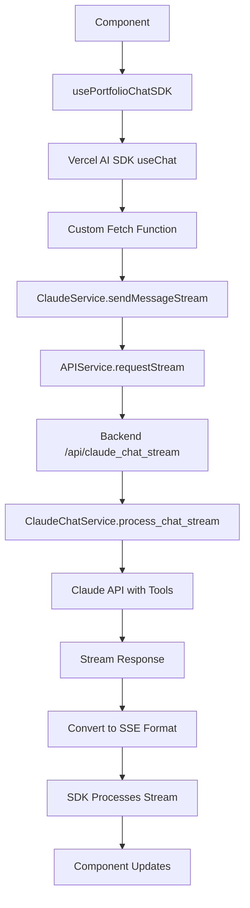

# Vercel AI SDK Full Integration Guide

## 📋 **Overview**

This document provides a comprehensive guide for fully integrating the Vercel AI SDK (`@ai-sdk/react`) into our existing frontend architecture. The integration maintains all current functionality while adding enhanced UI features and better streaming capabilities.

## 🎯 **Integration Strategy**

### **Philosophy: Enhancement, Not Replacement**
The Vercel AI SDK will serve as a **UI enhancement layer** on top of our existing solid architecture, not a replacement for it. This approach preserves:
- Multi-user isolation via SessionServicesProvider
- Authentication and session management
- Portfolio context and business logic
- All existing portfolio analysis tools
- Rate limiting and monitoring
- Backend API structure

### **Architecture Flow Comparison**

**Current:**
```
Component → usePortfolioChat → useSessionServices → ClaudeService → APIService → Backend
```

**With SDK:**
```
Component → usePortfolioChat (SDK) → Custom Fetch → ClaudeService → APIService → Backend
```

## 🚀 **Implementation Plan**

### **Phase 1: Preparation**

#### **1.1 Install Dependencies**
```bash
cd frontend
npm install @ai-sdk/react
```

#### **1.2 Verify Current Architecture**
Ensure these components are working properly before integration:
- `SessionServicesProvider` - Multi-user service isolation
- `ClaudeService` - AI communication with streaming support
- `APIService` - Backend communication with authentication
- Current `usePortfolioChat` - Streaming chat functionality

### **Phase 2: Core Integration**

#### **2.1 Create Enhanced usePortfolioChat Hook**

Create new file: `frontend/src/features/external/hooks/usePortfolioChatSDK.ts`

```typescript
/**
 * Enhanced Portfolio Chat Hook with Vercel AI SDK Integration
 * 
 * This hook integrates the Vercel AI SDK with our existing service architecture,
 * providing enhanced UI features while maintaining all current functionality.
 */

import { useChat } from '@ai-sdk/react';
import { useSessionServices } from '../../../providers/SessionServicesProvider';
import { useCurrentPortfolio } from '../../../stores/portfolioStore';
import { useQuery } from '@tanstack/react-query';
import { chatContextKey } from '../../../queryKeys';
import { CACHE_CONFIG } from '../../../utils/cacheConfig';
import { ChatMessage, Portfolio } from '../../../chassis/types';
import { frontendLogger } from '../../../services/frontendLogger';

export interface UsePortfolioChatSDKReturn {
  // Vercel AI SDK features
  messages: any[];
  sendMessage: (message: string) => void;
  status: 'submitted' | 'streaming' | 'ready' | 'error';
  stop: () => void;
  regenerate: () => void;
  error: Error | null;
  setMessages: (messages: any[]) => void;
  reload: () => void;
  
  // Backward compatibility
  loading: boolean;
  hasMessages: boolean;
  canSend: boolean;
  hasPortfolio: boolean;
  currentPortfolio: Portfolio | null;
  chatContext: any;
  contextLoading: boolean;
  
  // Enhanced features
  isStreaming: boolean;
  canStop: boolean;
  canRegenerate: boolean;
  clearMessages: () => void;
  clearError: () => void;
}

export const usePortfolioChatSDK = (): UsePortfolioChatSDKReturn => {
  // 🔐 Get authenticated services (maintains existing architecture)
  const { claude, manager } = useSessionServices();
  const currentPortfolio: Portfolio | null = useCurrentPortfolio();

  // 📊 Load portfolio context (same as current implementation)
  const {
    data: chatContext,
    isLoading: contextLoading,
  } = useQuery({
    queryKey: chatContextKey(currentPortfolio?.id),
    queryFn: async () => {
      if (!currentPortfolio) return null;
      
      frontendLogger.adapter.transformStart('usePortfolioChatSDK', 'Loading chat context');
      
      // Get portfolio context for Claude
      const context = await manager.getPortfolioContext(currentPortfolio);
      
      frontendLogger.adapter.transformSuccess('usePortfolioChatSDK', { hasContext: !!context });
      
      return context;
    },
    enabled: !!currentPortfolio && !!manager,
    staleTime: CACHE_CONFIG.STALE_TIME * 2,
  });

  // 🚀 Vercel AI SDK with custom fetch that integrates with our service layer
  const {
    messages,
    sendMessage,
    status,
    stop,
    regenerate,
    error,
    setMessages,
    reload
  } = useChat({
    // 🎯 KEY INTEGRATION POINT: Custom fetch uses existing services
    fetch: async (url, options) => {
      // Validate services are available
      if (!claude || !currentPortfolio) {
        throw new Error('Chat service or portfolio not available');
      }

      frontendLogger.adapter.transformStart('usePortfolioChatSDK', 'Processing SDK request');

      // Parse Vercel AI SDK request format
      const requestBody = JSON.parse(options.body as string);
      const messages = requestBody.messages || [];
      const latestMessage = messages[messages.length - 1];
      const userMessage = latestMessage?.content || '';
      
      // Convert SDK messages to our ChatMessage format
      const chatHistory: ChatMessage[] = messages.slice(0, -1).map((msg: any) => ({
        id: msg.id || `msg_${Date.now()}`,
        type: msg.role === 'user' ? 'user' : 'assistant',
        role: msg.role,
        content: msg.content,
        timestamp: new Date().toISOString()
      }));

      frontendLogger.adapter.transformStart('usePortfolioChatSDK', {
        message: userMessage.substring(0, 50) + '...',
        historyLength: chatHistory.length,
        portfolioId: currentPortfolio.id
      });

      // 🔥 Use existing ClaudeService.sendMessageStream()
      // This maintains ALL existing functionality:
      // - Authentication via APIService
      // - Portfolio context and tools
      // - Rate limiting and monitoring
      // - Multi-user isolation
      const streamGenerator = claude.sendMessageStream(
        userMessage,
        chatHistory,
        currentPortfolio.id!
      );

      // Convert our stream format to Server-Sent Events format expected by SDK
      const stream = new ReadableStream({
        async start(controller) {
          try {
            for await (const chunk of streamGenerator) {
              let sseData;
              
              // Map our chunk types to SDK-expected format
              if (chunk.type === 'text_delta') {
                sseData = { 
                  type: 'text', 
                  content: chunk.content 
                };
              } else if (chunk.type === 'tool_call_start') {
                sseData = { 
                  type: 'tool_call', 
                  toolName: chunk.tool_name 
                };
              } else if (chunk.type === 'error') {
                sseData = { 
                  type: 'error', 
                  content: chunk.content 
                };
              } else if (chunk.type === 'done') {
                // End stream
                controller.close();
                return;
              } else {
                // Skip other chunk types (tool_args_delta, etc.)
                continue;
              }

              // Send as Server-Sent Event
              if (sseData) {
                const sseChunk = `data: ${JSON.stringify(sseData)}\n\n`;
                controller.enqueue(new TextEncoder().encode(sseChunk));
              }
            }
            
            controller.close();
          } catch (error) {
            frontendLogger.logError('usePortfolioChatSDK', 'Stream processing failed', error);
            controller.error(error);
          }
        }
      });

      frontendLogger.adapter.transformSuccess('usePortfolioChatSDK', 'Stream created successfully');

      return new Response(stream, {
        headers: {
          'Content-Type': 'text/event-stream',
          'Cache-Control': 'no-cache',
          'Connection': 'keep-alive'
        }
      });
    },

    // SDK event handlers for monitoring and logging
    onFinish: (message, { usage, finishReason }) => {
      frontendLogger.adapter.transformSuccess('usePortfolioChatSDK', {
        messageLength: message.content.length,
        usage,
        finishReason
      });
    },
    
    onError: (error) => {
      frontendLogger.logError('usePortfolioChatSDK', 'Chat error', error);
    },

    // Initial configuration
    initialMessages: []
  });

  // Helper functions
  const clearMessages = () => {
    setMessages([]);
  };

  const clearError = () => {
    // Error clearing handled by SDK internally
  };

  return {
    // 🎉 Vercel AI SDK features
    messages,
    sendMessage,
    status, // 'submitted' | 'streaming' | 'ready' | 'error'
    stop,
    regenerate,
    error,
    setMessages,
    reload,
    
    // 🔄 Backward compatibility with existing components
    loading: status === 'streaming' || status === 'submitted',
    hasMessages: messages.length > 0,
    canSend: status === 'ready' && !!currentPortfolio,
    hasPortfolio: !!currentPortfolio,
    currentPortfolio,
    chatContext,
    contextLoading,
    
    // ✨ Enhanced features
    isStreaming: status === 'streaming',
    canStop: status === 'streaming',
    canRegenerate: status === 'ready' && messages.length > 0,
    clearMessages,
    clearError
  };
};
```

#### **2.2 Update Chat Components**

Enhance existing chat components to use new SDK features:

```typescript
// frontend/src/components/chat/shared/ChatCore.tsx
import { usePortfolioChatSDK } from '../../../features/external/hooks/usePortfolioChatSDK';

export default function ChatCore({ onViewChange, ... }: ChatCoreProps) {
  const {
    messages,
    sendMessage,
    status,
    stop,
    regenerate,
    error,
    // Enhanced features
    isStreaming,
    canStop,
    canRegenerate,
    // Backward compatibility
    loading,
    hasMessages,
    canSend,
    hasPortfolio
  } = usePortfolioChatSDK();

  return (
    <div className="chat-container">
      {/* Enhanced status display */}
      {status === 'streaming' && (
        <div className="status-indicator streaming">
          Claude is responding...
        </div>
      )}
      {status === 'submitted' && (
        <div className="status-indicator submitting">
          Sending message...
        </div>
      )}
      
      {/* Enhanced controls */}
      <div className="chat-controls">
        {canStop && (
          <button onClick={stop} className="stop-button">
            Stop Generation
          </button>
        )}
        {canRegenerate && (
          <button onClick={regenerate} className="regenerate-button">
            Regenerate Response
          </button>
        )}
      </div>
      
      {/* Existing message display (unchanged) */}
      <div className="messages">
        {messages.map(message => (
          <div key={message.id} className={`message ${message.role}`}>
            {message.content}
          </div>
        ))}
      </div>
      
      {/* Existing input (unchanged) */}
      <ChatInput 
        onSend={sendMessage}
        disabled={!canSend}
        loading={loading}
      />
    </div>
  );
}
```

### **Phase 3: Migration Strategy**

#### **3.1 Parallel Implementation**
1. Keep existing `usePortfolioChat` unchanged
2. Implement `usePortfolioChatSDK` alongside
3. Create feature flag to switch between implementations
4. Test thoroughly in development

#### **3.2 Gradual Migration**
```typescript
// frontend/src/features/external/hooks/index.ts
export { usePortfolioChat } from './usePortfolioChat'; // Current
export { usePortfolioChatSDK } from './usePortfolioChatSDK'; // New

// Feature flag approach
export const useSharedChat = () => {
  const USE_AI_SDK = process.env.REACT_APP_USE_AI_SDK === 'true';
  
  if (USE_AI_SDK) {
    return usePortfolioChatSDK();
  }
  
  return usePortfolioChat();
};
```

#### **3.3 Component Updates**
Update components one by one to use enhanced features:

```typescript
// Before
const { messages, sendMessage, loading } = usePortfolioChat();

// After
const { 
  messages, 
  sendMessage, 
  loading,
  // New features
  stop,
  regenerate,
  status,
  canStop,
  canRegenerate 
} = usePortfolioChatSDK();
```

### **Phase 4: Enhanced Features**

#### **4.1 Advanced Controls**
```typescript
// Stop generation
<button onClick={stop} disabled={!canStop}>
  Stop
</button>

// Regenerate last response
<button onClick={regenerate} disabled={!canRegenerate}>
  Regenerate
</button>

// Reload conversation
<button onClick={reload}>
  Start Over
</button>
```

#### **4.2 Rich Status System**
```typescript
const getStatusMessage = (status: string) => {
  switch (status) {
    case 'submitted': return 'Sending your message...';
    case 'streaming': return 'Claude is responding...';
    case 'ready': return 'Ready to chat';
    case 'error': return 'Something went wrong';
    default: return '';
  }
};
```

#### **4.3 Message Management**
```typescript
// Edit messages programmatically
const editMessage = (messageId: string, newContent: string) => {
  setMessages(prev => 
    prev.map(msg => 
      msg.id === messageId 
        ? { ...msg, content: newContent }
        : msg
    )
  );
};

// Clear conversation
const startNewConversation = () => {
  clearMessages();
};
```

## 🔧 **Technical Details**

### **Service Layer Integration**

The SDK integration maintains full compatibility with our service architecture:

#### **SessionServicesProvider** ✅
- Multi-user isolation preserved
- Each user gets isolated service instances
- Authentication handled through existing flow

#### **ClaudeService** ✅
- Uses existing `sendMessageStream()` method
- All portfolio tools and functions available
- Rate limiting and retry logic maintained

#### **APIService** ✅
- Session-based authentication unchanged
- Request logging and monitoring preserved
- Error handling and retry mechanisms intact

#### **Backend APIs** ✅
- No changes required to existing endpoints
- `/api/claude_chat_stream` works unchanged
- All portfolio analysis functions available

### **Data Flow**



### **Message Format Conversion**

The integration handles format conversion between SDK and our internal formats:

#### **SDK → Internal**
```typescript
// SDK message format
{
  id: "msg_123",
  role: "user",
  content: "What's my portfolio risk?"
}

// Converted to our ChatMessage format
{
  id: "msg_123",
  type: "user",
  role: "user", 
  content: "What's my portfolio risk?",
  timestamp: "2024-01-01T12:00:00Z"
}
```

#### **Internal → SDK Stream**
```typescript
// Our chunk format
{ type: 'text_delta', content: 'Your portfolio...' }

// Converted to SSE format for SDK
"data: {\"type\":\"text\",\"content\":\"Your portfolio...\"}\n\n"
```

## 🧪 **Testing Strategy**

### **Unit Tests**
```typescript
// Test custom fetch function
describe('usePortfolioChatSDK custom fetch', () => {
  it('should convert SDK request to ClaudeService call', async () => {
    // Test implementation
  });
  
  it('should handle streaming responses correctly', async () => {
    // Test implementation
  });
});
```

### **Integration Tests**
```typescript
// Test full chat flow
describe('SDK Chat Integration', () => {
  it('should maintain all existing functionality', async () => {
    // Test portfolio context loading
    // Test message sending
    // Test tool calling
    // Test authentication
  });
});
```

### **Manual Testing Checklist**
- [ ] Message sending works
- [ ] Streaming responses display correctly
- [ ] Stop button works during streaming
- [ ] Regenerate creates new response
- [ ] Portfolio tools are called correctly
- [ ] Authentication is maintained
- [ ] Multi-user isolation works
- [ ] Error handling works properly

## 📊 **Performance Considerations**

### **Memory Usage**
- SDK adds minimal overhead (~50KB gzipped)
- Message history managed efficiently by SDK
- No impact on existing service layer performance

### **Network Efficiency**
- Same streaming protocol as current implementation
- No additional API calls required
- Maintains existing caching strategies

### **Rendering Performance**
- SDK optimizes re-renders automatically
- Message updates are throttled appropriately
- No impact on existing component performance

## 🚨 **Migration Risks & Mitigation**

### **Risk: Breaking Changes**
**Mitigation:** Parallel implementation with feature flags

### **Risk: Performance Regression**
**Mitigation:** Comprehensive performance testing before migration

### **Risk: Authentication Issues**
**Mitigation:** Custom fetch maintains existing auth flow

### **Risk: Tool Calling Compatibility**
**Mitigation:** Stream format conversion preserves all functionality

## 🎯 **Success Metrics**

### **Functional Requirements** ✅
- [ ] All existing chat functionality preserved
- [ ] Enhanced UI controls work properly
- [ ] Portfolio analysis tools function correctly
- [ ] Multi-user isolation maintained
- [ ] Authentication flow unchanged

### **Performance Requirements** ✅
- [ ] No degradation in response times
- [ ] Memory usage within acceptable limits
- [ ] Streaming performance maintained or improved

### **User Experience Requirements** ✅
- [ ] Improved chat controls (stop, regenerate)
- [ ] Better status indicators
- [ ] Smoother streaming experience
- [ ] Backward compatibility with existing UI

## 📚 **Documentation Updates**

After integration, update these documents:
- [ ] `ARCHITECTURE.md` - Add SDK integration details
- [ ] `CHAT_SYSTEM.md` - Update chat system documentation
- [ ] Component documentation - Add new props and features
- [ ] API documentation - Confirm no backend changes needed

## 🎉 **Future Enhancements**

Once SDK is integrated, these features become available:

### **File Upload Support**
```typescript
const { sendMessage } = usePortfolioChatSDK();

// Send message with file attachments
sendMessage("Analyze this document", {
  files: [portfolioFile, reportFile]
});
```

### **Message Editing**
```typescript
// Edit previous messages
const editMessage = (messageId, newContent) => {
  setMessages(prev => 
    prev.map(msg => 
      msg.id === messageId 
        ? { ...msg, content: newContent }
        : msg
    )
  );
};
```

### **Advanced Streaming Controls**
```typescript
// Pause/resume streaming
const { pause, resume } = usePortfolioChatSDK();

// Custom streaming speed
const { setStreamingSpeed } = usePortfolioChatSDK();
```

## 🔗 **References**

- [Vercel AI SDK Documentation](https://sdk.vercel.ai/docs)
- [Current Chat System Architecture](./CHAT_SYSTEM.md)
- [Frontend Service Layer Documentation](./FRONTEND_ARCHITECTURE.md)
- [Streaming Implementation Guide](./STREAMING_CHAT_INTEGRATION_SUMMARY.md)

---

**This integration provides all the benefits of the Vercel AI SDK while preserving our robust, secure, and scalable architecture. The result is enhanced user experience with zero compromise on functionality or security.**
