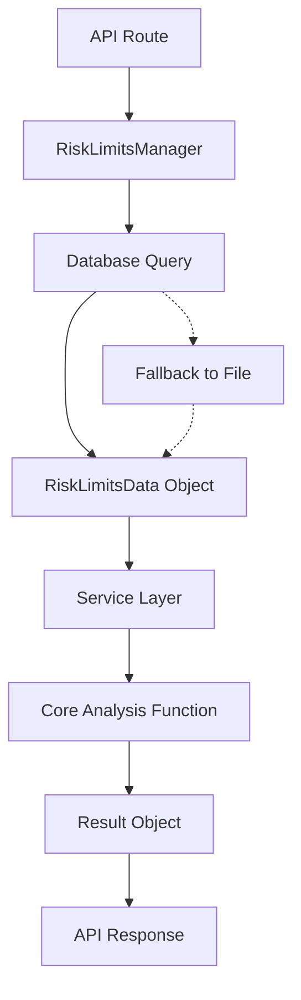

# Database-First Risk Limits Architecture Pattern

## Overview

This document describes the complete architectural pattern for implementing database-first risk limits loading, using the `/risk-score` endpoint as the reference implementation. This pattern replaces hardcoded YAML file dependencies with dynamic database-driven risk limits while maintaining robust fallback mechanisms.

## 🎯 Problem Solved

**Before**: Routes used hardcoded `risk_limits.yaml` files:
```python
with open("risk_limits.yaml", "r") as f:
    risk_config = yaml.safe_load(f)
```

**After**: Routes use user-specific database risk limits with smart fallbacks:
```python
risk_config_manager = RiskLimitsManager(use_database=True, user_id=user['user_id'])
risk_limits_data = risk_config_manager.load_risk_limits(portfolio_name)
```

## 🏗️ Architecture Components

### 1. Core Data Flow



### 2. Key Components

#### A. **RiskLimitsManager** (`inputs/risk_limits_manager.py`)
- **Purpose**: Central manager for loading risk limits from database or file
- **Features**: User-specific queries, automatic fallbacks, type-safe operations
- **Initialization**: 
  ```python
  risk_config_manager = RiskLimitsManager(use_database=True, user_id=user['user_id'])
  ```

#### B. **RiskLimitsData** (`core/data_objects.py`)
- **Purpose**: Type-safe data container for risk limits
- **Features**: Validation, serialization, metadata tracking
- **Structure**: Matches `risk_limits.yaml` format + metadata

#### C. **Service Layer** (`services/portfolio_service.py`)
- **Purpose**: Orchestrates analysis with RiskLimitsData objects
- **Features**: Metadata extraction, result structuring, caching

#### D. **API Response Structure**
- **Wrapper Level**: Context metadata (`risk_limits_metadata`)
- **Data Level**: Analysis results with embedded metadata

## 📋 Implementation Pattern

### Step 1: API Route Setup
```python
# 1. Initialize RiskLimitsManager with user context
from inputs.risk_limits_manager import RiskLimitsManager
risk_config_manager = RiskLimitsManager(use_database=True, user_id=user['user_id'])

# 2. Track metadata for API response
risk_limits_name = None

# 3. Load risk limits with fallback handling
try:
    risk_limits_data = risk_config_manager.load_risk_limits(portfolio_name)
    if risk_limits_data.is_empty():
        # No user limits found - use default file
        risk_limits_name = "Default"
        result = service.analyze_function(portfolio_data, None)
    else:
        # Use user-specific risk limits
        risk_limits_name = risk_limits_data.name
        result = service.analyze_function(portfolio_data, risk_limits_data)
except Exception as e:
    # Risk limits loading failed - fall back to default file
    logger.warning(f"Risk limits loading failed for user {user['user_id']}: {e}")
    risk_limits_name = "Default (Fallback)"
    result = service.analyze_function(portfolio_data, None)
```

### Step 2: Service Layer Integration
```python
def analyze_function(self, portfolio_data: PortfolioData, risk_limits_data: Optional[RiskLimitsData]):
    """
    Analyze portfolio with optional database risk limits.
    
    Args:
        portfolio_data: Portfolio configuration
        risk_limits_data: Database risk limits (None = use default file)
    """
    if risk_limits_data is None:
        # Use default file fallback
        effective_risk_file = "risk_limits.yaml"
    else:
        # Convert RiskLimitsData to temporary file for core functions
        risk_dict = risk_limits_data.to_dict()
        with tempfile.NamedTemporaryFile(mode='w', suffix='.yaml', delete=False) as f:
            yaml.dump(risk_dict, f)
            effective_risk_file = f.name
    
    # Call core analysis function
    analysis_result = core_analysis_function(portfolio_file, effective_risk_file)
    
    # Extract metadata for result object
    if risk_limits_data:
        risk_limits_name = risk_limits_data.name
    else:
        risk_limits_name = "Default"
    
    # Create structured result with metadata
    result = ResultObject.from_analysis(
        analysis_result,
        portfolio_name=portfolio_data.portfolio_name,
        risk_limits_name=risk_limits_name
    )
    
    return result
```

### Step 3: API Response Structure
```python
# Enhanced API wrapper with dual metadata
api_response.update({
    'success': True,
    'summary': result.get_summary(),
    'portfolio_metadata': {
        'name': portfolio_name,
        'user_id': user['user_id'],
        'source': 'database',
        'analyzed_at': datetime.now(UTC).isoformat()
    },
    'risk_limits_metadata': {
        'name': risk_limits_name,
        'source': 'database' if risk_limits_name not in ['Default', 'Default (Fallback)'] else 'file'
    }
})
```

## 🔄 Fallback Strategy

### Enhanced Fallback Strategy

1. **Primary**: Database risk limits for user/portfolio
2. **Auto-Creation**: If no limits exist, automatically create database defaults for the portfolio
3. **Tertiary**: Default file only for genuine database connection failures

### Fallback Indicators
- `"Loaded_Limits"` → Database source (existing user limits)
- `"Default"` → Auto-created database defaults (new portfolio)
- `"Default (Fallback)"` → Database connection error (file fallback)

## 📊 Data Structures

### RiskLimitsData Object
```python
@dataclass
class RiskLimitsData:
    # Core limit categories (matching risk_limits.yaml structure)
    portfolio_limits: Optional[Dict[str, float]] = None
    concentration_limits: Optional[Dict[str, float]] = None  
    variance_limits: Optional[Dict[str, float]] = None
    max_single_factor_loss: Optional[float] = None
    additional_settings: Optional[Dict[str, Any]] = None
    
    # Metadata
    name: Optional[str] = None  # "Conservative", "Aggressive", etc.
    user_id: Optional[int] = None
    portfolio_id: Optional[int] = None
    
    def to_dict(self) -> Dict[str, Any]:
        """Convert to risk_limits.yaml format for core calculations."""
    
    def is_empty(self) -> bool:
        """Check if risk limits contain any actual limit data."""
```

### API Response Structure
```json
{
  "success": true,
  "portfolio_metadata": {
    "name": "CURRENT_PORTFOLIO",
    "user_id": 1,
    "source": "database",
    "analyzed_at": "2025-08-07T18:28:35"
  },
  "risk_limits_metadata": {
    "name": "Loaded_Limits",
    "source": "database"
  },
  "data": {
    "risk_score": { ... },
    "portfolio_name": "CURRENT_PORTFOLIO",
    "risk_limits_name": "Loaded_Limits",
    "analysis_date": "2025-08-07T18:28:35",
    // ... analysis results
  }
}
```

## 🚀 Benefits

### 1. **User-Specific Risk Management**
- Each user can have custom risk limits
- Portfolio-specific risk profiles
- Dynamic risk limit updates without code changes

### 2. **Robust Fallback Chain**
- Never fails due to missing risk limits
- Graceful degradation to default files
- Clear indicators of which source was used

### 3. **Type Safety**
- All operations use `RiskLimitsData` objects
- Compile-time validation of risk limit structure
- Consistent data format across system

### 4. **Architectural Consistency**
- Same pattern as `PortfolioManager` (database-first)
- Consistent metadata in API responses
- Clean separation of concerns

### 5. **Backwards Compatibility**
- Core analysis functions unchanged
- Existing YAML files still work as fallbacks
- Progressive migration path

## 🔧 Migration Guide

### For Existing Routes Using Hardcoded YAML

#### Current Pattern (❌ Legacy):
```python
# OLD: Hardcoded file loading
with open("risk_limits.yaml", "r") as f:
    risk_config = yaml.safe_load(f)

result = core_analysis_function(portfolio_file, "risk_limits.yaml")
```

#### New Pattern (✅ Database-First):
```python
# NEW: Database-first with fallbacks
from inputs.risk_limits_manager import RiskLimitsManager

risk_config_manager = RiskLimitsManager(use_database=True, user_id=user['user_id'])
risk_limits_data = risk_config_manager.load_risk_limits(portfolio_name)

if risk_limits_data.is_empty():
    result = service.analyze_function(portfolio_data, None)  # Uses default file
else:
    result = service.analyze_function(portfolio_data, risk_limits_data)  # Uses database
```

### Required Changes by Layer:

#### 1. **API Route** (`routes/api.py`):
- Add `RiskLimitsManager` initialization
- Add risk limits loading with fallback handling
- Add `risk_limits_metadata` to API wrapper
- Track `risk_limits_name` for response

#### 2. **Service Layer** (`services/portfolio_service.py`):
- Modify service methods to accept `Optional[RiskLimitsData]`
- Add database/file conditional logic
- Extract metadata for result objects
- Handle temporary file creation for core functions

#### 3. **Result Objects** (`core/result_objects.py`):
- Add `risk_limits_name` field to result dataclasses
- Update `from_analysis` factory methods to accept metadata
- Include metadata in `to_api_response()` methods

#### 4. **Core Functions** (No Changes Required):
- Keep existing YAML file interfaces
- Maintain backwards compatibility
- No changes to analysis logic

## 📚 Reference Implementation

The `/risk-score` endpoint in `routes/api.py` (lines 415-460) serves as the complete reference implementation of this pattern. Key files:

- **API Route**: `routes/api.py` (risk-score endpoint)
- **Service Layer**: `services/portfolio_service.py` (analyze_risk_score method)
- **Data Manager**: `inputs/risk_limits_manager.py` 
- **Data Objects**: `core/data_objects.py` (RiskLimitsData)
- **Result Objects**: `core/result_objects.py` (RiskScoreResult)

## 🎯 Next Steps

### Routes to Migrate:
1. **`/analyze`** - Replace hardcoded `risk_limits.yaml` (line 318-319 in `run_risk.py`)
2. **`/portfolio-analysis`** - Same pattern (line 60-61, 89 in `core/portfolio_analysis.py`)

### Future Enhancements:
1. **Default Risk Profiles**: Create database default risk limits to eliminate file fallbacks
2. **Risk Limit Templates**: User interface for creating/managing risk profiles
3. **Validation Rules**: Enhanced risk limit validation and constraints
4. **Audit Trail**: Track risk limit changes and usage

## ⚠️ Important Notes

1. **Never Remove YAML Fallbacks**: Always maintain file fallback capability for system stability
2. **Metadata Consistency**: Always include both wrapper-level and data-level metadata
3. **Error Handling**: Never let risk limits loading failure break the endpoint
4. **Type Safety**: Always use `RiskLimitsData` objects, never raw dictionaries
5. **User Context**: Always pass `user_id` to `RiskLimitsManager` for proper isolation

This pattern ensures robust, user-specific risk management while maintaining system stability and backwards compatibility.