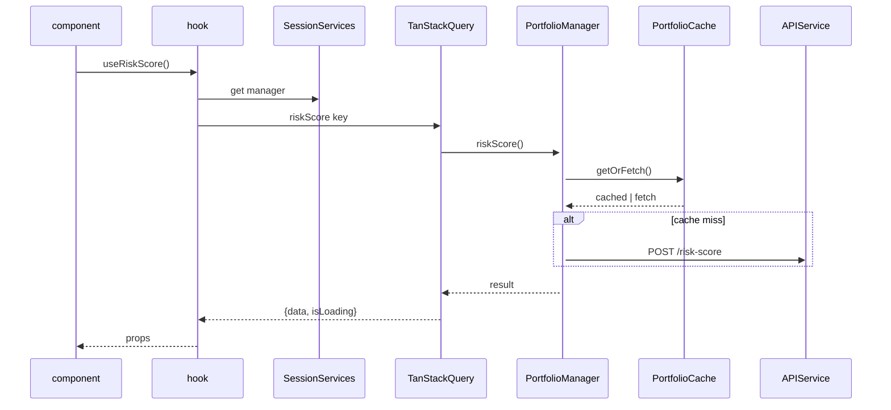

# Front-End Refactor Blueprint – Session-Scoped Services & Slice Stores

## 0  Overview
This document captures the target architecture **and** the ordered implementation plan that migrates the current “multi-manager” front-end into a clean, single-source-of-truth design.

* Goals
  * Exactly **one** `APIService`, `PortfolioCache`, and `PortfolioManager` per logged-in user *per browser tab*.
  * Remove duplicate stores; split global state by bounded context.
  * Use TanStack Query for fetching, caching, retries, and background refresh.
  * Eliminate duplicate network calls, stale overwrites, and cross-user cache leaks.

---

## 1  Target Architecture
```
frontend/src/
├─ stores/                  # NEW - Zustand slices
│   ├─ authStore.ts
│   ├─ portfolioStore.ts
│   └─ uiStore.ts
├─ providers/               # NEW - React providers
│   ├─ AuthProvider.tsx
│   ├─ QueryProvider.tsx    # TanStack
│   └─ SessionServicesProvider.tsx
├─ services/                # NEW + existing services
│   ├─ PortfolioCache.ts    # Enhanced user-scoped cache
│   └─ frontendLogger.ts    # existing
├─ hooks/                   # NEW - TanStack Query hooks
│   └─ useRiskScore.ts      # pilot hook
├─ chassis/                 # EXISTING - keep during migration
│   ├─ services/
│   │   ├─ APIService.ts
│   │   ├─ PortfolioCacheService.ts
│   │   └─ ClaudeService.ts
│   ├─ managers/
│   │   └─ PortfolioManager.ts
│   ├─ hooks/               # keep until migration complete
│   │   └─ useRiskScore.ts  # deprecate after new hooks adopted
│   └─ types/
├─ store/                   # EXISTING - deprecate in Phase 6
│   ├─ AppStore.ts
│   └─ dashboardStore.ts
├─ adapters/                # unchanged
├─ components/              # unchanged (just update imports)
└─ utils/                   # NEW
    └─ broadcastLogout.ts
```

### 1.1  Layer Responsibilities
| Layer | Responsibility | Lifetime |
|-------|---------------|----------|
| **Stores** | Minimal global state (auth, portfolios, UI) | until tab refresh |
| **Services** | Stateless helpers (`APIService`, `PortfolioCache`) | recreated on user change |
| **Manager** | Orchestrates workflows using services | recreated on user change |
| **Providers** | Create/destroy services+manager and expose via React Context | React tree lifetime |
| **Hooks** | Call manager via TanStack Query and expose `{ data, isLoading, error }` | per component |
| **Adapters / Components** | Pure transforms & UI | unchanged |

### 1.2  Data Flow (Risk Score)


---

## 2  Implementation Plan (Step-by-Step)

### Phase 0  – Prep
1. `npm i @tanstack/react-query zustand`

### Phase 1  – Slice Stores (RF1)
1. **`authStore.ts`** – `user`, `token`, `signIn()`, `signOut()`.
2. **`portfolioStore.ts`** – `byId: Record<id, PortfolioState>` with helpers.
3. **`uiStore.ts`** – `activeView`, `theme`, `notifications`…

### Phase 2  – Providers Layer (RF2, RF3)
1. **`AuthProvider.tsx`** – reads cookies/backend; populates `authStore`.
2. **`QueryProvider.tsx`** – wraps `QueryClientProvider`.
3. **`SessionServicesProvider.tsx`**
   ```tsx
   const ctx = createContext<Services | null>(null);
   const Provider: React.FC = ({ children }) => {
     const { user } = useAuthStore();
     const ref = useRef<Services | null>(null);
     useEffect(() => {
       if (user) {
         const api   = new APIService();
         const claude = new ClaudeService();
         const manager = new PortfolioManager(api, claude);
         const cache = new PortfolioCacheService(api); // existing service
         ref.current = { api, cache, manager, claude };
       } else {
         ref.current = null;
       }
     }, [user?.id]);
     return <ctx.Provider value={ref.current}>{children}</ctx.Provider>;
   };
   export const useSessionServices = () => {
     const v = useContext(ctx);
     if (!v) throw new Error('SessionServicesProvider missing');
     return v;
   };
   ```

### Phase 3  – Service Refinements
* **`PortfolioCache.ts`** – rename/move; key = ``${userId}_${op}_${portfolioHash}``.
* **`APIService.ts`** – accept `getToken` callback; attach `Authorization` header.

### Phase 4  – Pilot Hook Conversion (useRiskScore) (RF4)
* Drop inline `new PortfolioManager()`.
* Use `useSessionServices()` + `useQuery(['riskScore', portfolioId], …)`.
* Delete manual loading/error state; rely on Query flags.

### Phase 5  – Migrate Remaining Hooks (RF5, RF6)
* Repeat for `useRiskAnalysis`, `usePortfolio`, `usePortfolioSummary`, etc.
* Remove all `new PortfolioManager(` occurrences.

### Phase 6  – Global Store Cleanup (RF7)
* Delete `frontend/src/store/dashboardStore.ts`.
* Gradually deprecate `AppStore.ts`; move remnants into slice stores, then delete.

### Phase 7  – Cross-Session Polish (RF8, RF9)
1. **`utils/broadcastLogout.ts`** – `new BroadcastChannel('risk-app').postMessage('logout')`.
2. Guard verbose `frontendLogger` calls with `if (process.env.NODE_ENV !== 'production')`.
3. In `authStore.signOut()` → clear `queryClient`, `localStorage`, broadcast logout.

---

## 3  Files Impact Matrix
| Action | Path |
|———|——|
| **ADD** | `providers/AuthProvider.tsx` |
|        | `providers/QueryProvider.tsx` |
|        | `providers/SessionServicesProvider.tsx` |
|        | `stores/authStore.ts` |
|        | `stores/portfolioStore.ts` |
|        | `stores/uiStore.ts` |
|        | `services/PortfolioCache.ts` |
|        | `hooks/useRiskScore.ts` (new TanStack version) |
|        | `utils/broadcastLogout.ts` |
| **EDIT** | `index.js` or `App.tsx` – wrap providers |
|        | `chassis/services/APIService.ts` – token injection (optional) |
|        | Component imports: `chassis/hooks/` → `hooks/` |
| **DELETE** | `store/dashboardStore.ts` (Phase 6) |
|        | `store/AppStore.ts` (Phase 6) |
|        | `chassis/hooks/` files (after migration complete) |

---

## 4  Unchanged Components
* All **adapters** (e.g., `RiskScoreAdapter`) stay as pure transforms.
* All **TSX components** keep their props; only internal hooks change.
* Routing, CSS, ClaudeService remain untouched.

---

## 5  Testing Strategy
1. Unit-test `PortfolioCache` (dedup + TTL) with mocked fetchers.
2. Jest test for `SessionServicesProvider` – ensures exactly one manager instance.
3. Integration test: sign in → view risk score → sign out → sign in as new user → previous cache not visible.

---

## 6  Risks & Mitigations
| Risk | Mitigation |
|-----|------------|
| Large PR breakage | Merge phases separately; each phase is functional. |
| Legacy components still import `AppStore` | Search/CI rule forbidding new `AppStore` imports; deprecate gradually. |
| Auth token mismatch | `APIService` reads token lazily (`getToken`), so provider rebuild not required for refresh tokens. |

---

### DONE 🎉
This file is the single source of truth for the refactor. Update checklist IDs (RF1…RF9) in the repository TODO system as tasks progress. 