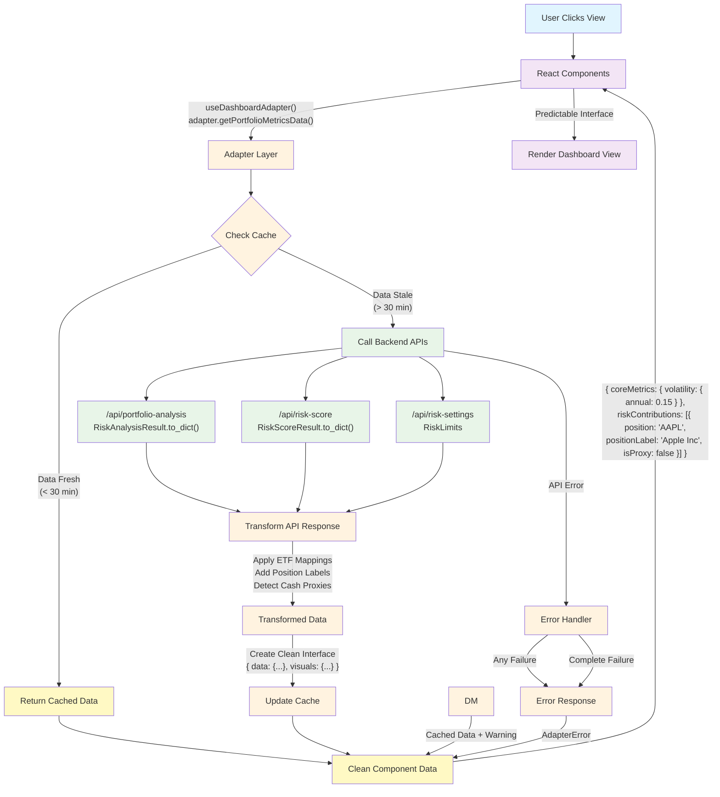

# Risk Analysis Dashboard Implementation Plan

## Overview
This document outlines the design and implementation plan for a unified Risk Analysis Dashboard that consolidates all portfolio risk analysis outputs into a single, interactive interface with integrated AI assistance.

## High-Level Vision

The Risk Analysis Dashboard provides users with comprehensive portfolio risk insights through:
- **Multiple analysis views** (Risk Score, Metrics, Factors, etc.)
- **Dual display modes** (Data tables + Visual charts)
- **Context-aware AI chat** that understands what analysis is being viewed
- **Simple, intuitive navigation** between different types of analysis
- **Resilient adapter architecture** that eliminates API coupling and ensures maintainability

## Visual Design

### 🎨 **[DESIGN SPEC NEEDED]** Overall Theme & Styling

**📋 Design Specifications To Be Defined:**
- **Color Palette**: Primary, secondary, accent colors, neutral grays
- **Typography**: Font families, sizes, weights, line heights
- **Spacing System**: Padding, margins, grid spacing units  
- **Component Styling**: Button styles, form elements, borders, shadows
- **Visual Hierarchy**: How to emphasize important information
- **Brand Guidelines**: Logo placement, brand color integration

### Main Layout - Three-Panel Professional Layout

**Design Rationale**: Left sidebar navigation chosen for:
- **Professional feel** - Matches enterprise analysis tools
- **Descriptive labels** - Room for clear, readable navigation items
- **Scalability** - Easy to add more analysis types without crowding
- **Three-panel balance** - Navigation | Analysis | Assistance
- **Mobile adaptability** - Collapses to hamburger menu on small screens

### 🎨 **[DESIGN SPEC NEEDED]** Layout Component Visual Design

**📋 Portfolio Summary Bar:**
- **Layout**: Horizontal arrangement of key metrics, responsive behavior
- **Typography**: Font sizes and weights for metrics vs labels
- **Colors**: Background, text colors, status indicators
- **Icons**: Risk level indicators, details button styling

**📋 Left Sidebar Navigation:**
- **Background**: Color scheme, border styling
- **Navigation Items**: Button styling, active states, hover effects
- **Icons**: Icon styling, size, color, alignment
- **Mobile Behavior**: Hamburger menu design, slide-out animation

```
┌─────────────────────────────────────────────────────────────┐
│ Portfolio Summary: Risk 75/100 | Vol 18.5% | [⚙️ Details]   │
├─────────────┬───────────────────────────────┬───────────────┤
│             │                               │               │
│ 📊 Risk     │                               │               │
│    Score    │                               │               │
│             │                               │               │
│ 🎯 Factor   │        Content Area           │  Context-     │
│    Analysis │                               │  aware        │
│             │   Changes based on selected   │  assistance   │
│ 📊 Performance │   analysis view           │               │
│    Analytics│                               │               │
│             │                               │               │
│ 📋 Analysis │                               │               │
│    Report   │                               │               │
│             │                               │               │
│ ⚙️ Risk     │                               │               │
│    Limits   │                               │               │
│             │                               │               │
└─────────────┴───────────────────────────────┴───────────────┘
```

### View-Specific Layouts

#### 1. Risk Score View (Full Width)

### 🎨 **[DESIGN SPEC NEEDED]** Risk Score Display Design

**📋 Visual Components To Be Defined:**
- **Score Indicator**: Circular progress ring, numeric display, color coding (red/yellow/green)
- **Component Breakdown**: Visual arrangement of volatility, concentration, correlation scores  
- **Risk Factors List**: How risk factors are presented (cards, list, icons)
- **Recommendations Section**: Styling for actionable recommendations
- **Compliance Status**: Visual indicators for limit violations or warnings

```
┌─────────────────────────────────┐
│        Risk Score Display        │
│  ┌──────────────────────┐       │
│  │   🟢 75/100          │       │
│  └──────────────────────┘       │
│  Component Breakdowns...         │
│  ⚠️ Risk Factors...              │
│  💡 Recommendations...           │
└─────────────────────────────────┘
```

#### 2. Split Views (Metrics, Factors, etc.)

### 🎨 **[DESIGN SPEC NEEDED]** Split View Design

**📋 Data Panel Visual Design:**
- **Table Styling**: Headers, row styling, borders, alternating colors
- **Metric Cards**: Card design for key metrics display
- **Typography**: Font sizes for headers, data, labels
- **Cash Proxy Indicators**: Visual distinction for SGOV and other cash positions

**📋 Visual Panel Chart Design:**
- **Chart Types**: Pie charts, bar charts, line graphs, heatmaps
- **Color Schemes**: Consistent color palette across all visualizations
- **Legends**: Positioning, styling, interactive behavior
- **Tooltips**: Design for hover information display

**📋 Layout Option A: Horizontal Split (Side-by-Side)**
```
┌──────────────┬──────────────────┐
│   DATA       │    VISUALS       │
│              │                  │
│ Tables       │ Charts           │
│ Numbers      │ Graphs           │
│ Raw Values   │ Visualizations   │
└──────────────┴──────────────────┘
```

**📋 Layout Option B: Vertical Stack (Recommended)**
```
┌────────────────────────────────────┐
│           DATA PANEL               │
│                                    │
│ Key Metrics  │ Summary Tables      │
│ Risk Score   │ Factor Exposures    │
│ Portfolio    │ Position Details    │
├────────────────────────────────────┤
│          VISUALS PANEL             │
│                                    │
│ ┌─────────────┬─────────────────┐  │
│ │ Radar Chart │ Risk Contrib.   │  │
│ │ (Factors)   │ Bar Chart       │  │
│ ├─────────────┼─────────────────┤  │
│ │ Variance    │ Position-Factor │  │
│ │ Pie Chart   │ Heatmap         │  │
│ └─────────────┴─────────────────┘  │
└────────────────────────────────────┘
```

**💻 Implementation Options:**
```tsx
// Option A: Horizontal Split (Side-by-Side)
<div className="split-view horizontal">
  <DataPanel data={viewData.data} className="data-panel" />
  <VisualsPanel visuals={viewData.visuals} className="visuals-panel" />
</div>

// Option B: Vertical Stack (Recommended - Better UX)
<div className="split-view vertical">
  <DataPanel data={viewData.data} className="data-panel-top" />
  <VisualsPanel visuals={viewData.visuals} className="visuals-panel-bottom" />
</div>
```

**🎯 Layout Decision:**
Both options work with the same clean data interfaces. **Vertical stacking is recommended** for better screen real estate usage, mobile responsiveness, and natural data-to-visuals cognitive flow.

## Architecture

### Component Hierarchy

```
App
└── RiskAnalysisDashboard
    ├── DashboardAdapter (Data abstraction layer)
    ├── SummaryBar
    │   └── Key portfolio metrics (always visible)
    ├── MainLayout (three-panel)
    │   ├── LeftSidebar
    │   │   └── NavigationMenu (vertical list of analysis types)
    │   ├── ContentArea
    │   │   ├── RiskScoreView (full width)
    │   │   └── SplitView
    │   │       ├── DataPanel
    │   │       └── VisualPanel
    │   └── AIChatPanel
    │       └── Context-aware chat interface
```

### Adapter Layer Architecture

**🏗️ Foundation Layer: Eliminates API Coupling Risk**

The **Dashboard Adapter Layer** provides clean, stable interfaces between complex API responses and React components, ensuring maintainability and resilience to backend changes.

```
Complex API Responses → ADAPTER LAYER → Clean Component Interfaces
```

#### Core Benefits:
- **API Change Resilience** - Backend restructuring doesn't break views
- **Clean Component Interfaces** - Components use predictable, business-focused data structures  
- **Built-in System Integration** - ETF mappings, cash proxy detection, position labeling
- **Intelligent Caching** - 30-minute TTL aligned with backend, automatic invalidation
- **Error Isolation** - API failures don't crash entire dashboard

#### Adapter Interface:
```typescript
interface DashboardAdapter {
  // View-specific data methods
  getRiskScoreData(): Promise<RiskScoreViewData>;
  getFactorAnalysisData(): Promise<FactorsViewData>;
  getPerformanceAnalysisData(): Promise<PerformanceViewData>;
  getAnalysisReportData(): Promise<ReportViewData>;
  getRiskSettingsData(): Promise<SettingsViewData>;
  
  // Portfolio context
  getPortfolioSummary(): Promise<PortfolioSummary>;
  refreshPrices(): Promise<void>;
  
  // Error handling & retry
  getLastError(): AdapterError | null;
  retryFailedOperation(operationId: string): Promise<any>;
}
```

#### Component Integration Example:
```typescript
// ❌ OLD: Component tightly coupled to API structure
const MetricsView = ({ analysisData }) => {
  const volatility = analysisData.analysis.volatility_annual; // FRAGILE!
  return <div>{volatility}</div>;
};

// ✅ NEW: Component uses clean adapter interface
const MetricsView = () => {
  const adapter = useDashboardAdapter();
  const { data } = useAsyncData(() => adapter.getPortfolioMetricsData());
  const volatility = data.coreMetrics.volatility.annual; // STABLE!
  return <div>{volatility}</div>;
};
```

### State Management with Zustand

**🚀 Why Zustand:** Eliminates React Context performance issues through selective subscriptions - components only re-render when their specific data changes.

```typescript
// Zustand store with strict TypeScript interfaces
interface ViewState {
  data: any;
  isLoading: boolean;
  error: AdapterError | null;
  lastUpdated: Date;
}

interface DashboardStore {
  // View state
  activeView: 'score' | 'metrics' | 'factors' | 'report' | 'settings';
  
  // Data state (normalized by view)
  viewStates: {
      score: ViewState;
  factors: ViewState;
  performance: ViewState;
  report: ViewState;
  settings: ViewState;
  };
  
  // Portfolio context
  portfolioSummary: PortfolioSummary | null;
  
  // Chat state
  chatMessages: ChatMessage[];
  chatContext: {
    currentView: string;
    visibleData: any;
  };
  
  // Actions
  setActiveView: (view: string) => void;
  setViewData: (viewId: string, data: any) => void;
  setViewLoading: (viewId: string, isLoading: boolean) => void;
  setViewError: (viewId: string, error: AdapterError | null) => void;
  setPortfolioSummary: (summary: PortfolioSummary) => void;
  addChatMessage: (message: ChatMessage) => void;
  updateChatContext: (context: { currentView: string; visibleData: any }) => void;
}

// Store implementation
const useDashboardStore = create<DashboardStore>((set, get) => ({
  // Initial state
  activeView: 'score',
  viewStates: {
      score: { data: null, isLoading: false, error: null, lastUpdated: new Date() },
  factors: { data: null, isLoading: false, error: null, lastUpdated: new Date() },
  performance: { data: null, isLoading: false, error: null, lastUpdated: new Date() },
  report: { data: null, isLoading: false, error: null, lastUpdated: new Date() },
  settings: { data: null, isLoading: false, error: null, lastUpdated: new Date() }
  },
  portfolioSummary: null,
  chatMessages: [],
  chatContext: { currentView: 'score', visibleData: null },
  
  // Actions
  setActiveView: (view) => set({ activeView: view }),
  
  setViewData: (viewId, data) => set(state => ({
    viewStates: {
      ...state.viewStates,
      [viewId]: {
        ...state.viewStates[viewId],
        data,
        isLoading: false,
        error: null,
        lastUpdated: new Date()
      }
    }
  })),
  
  setViewLoading: (viewId, isLoading) => set(state => ({
    viewStates: {
      ...state.viewStates,
      [viewId]: { ...state.viewStates[viewId], isLoading }
    }
  })),
  
  setViewError: (viewId, error) => set(state => ({
    viewStates: {
      ...state.viewStates,
      [viewId]: { ...state.viewStates[viewId], error, isLoading: false }
    }
  })),
  
  setPortfolioSummary: (summary) => set({ portfolioSummary: summary }),
  
  addChatMessage: (message) => set(state => ({
    chatMessages: [...state.chatMessages, message]
  })),
  
  updateChatContext: (context) => set({ chatContext: context })
}));
```

### Unified Debugging Infrastructure

**🔧 AI-Friendly Debugging: All Frontend Activity Visible in Terminal**

The **Unified Logging Infrastructure** pipes all frontend activity (components, adapters, state, performance, network) to the backend terminal for real-time Claude debugging visibility, eliminating the need to copy/paste browser console logs.

#### Architecture Overview:
```
Frontend Components → Frontend Logger → Flask Endpoint → Terminal + Log Files
                                                      ↑
                                                  Claude sees everything
```

#### Categories & Benefits:
- **Component Lifecycle** - Mount/unmount, state changes, errors, user interactions
- **Adapter Operations** - Data transformations, API calls, errors  
- **State Management** - Store updates, subscriptions
- **Performance Monitoring** - Slow operations (>1s), render times, API response times
- **Network Activity** - All HTTP requests/responses with status codes and timing
- **User Interactions** - Button clicks, navigation, form submissions

#### Frontend Logger Integration:
```typescript
import { frontendLogger as log } from './services/frontendLogger';

// Component logging
useEffect(() => {
  log.component.mounted('RiskDashboard', { userId: user.id });
  
  return () => log.component.unmounted('RiskDashboard');
}, []);

// Adapter logging
async getPortfolioMetricsData(): Promise<PortfolioMetrics> {
  if (this.isValidCache('portfolio_metrics')) {
    log.state.cacheHit('RiskDashboardAdapter', 'portfolio_metrics');
    return this.cache.get('portfolio_metrics')!.data;
  }
  
  log.adapter.transformStart('RiskDashboardAdapter', { operation: 'getPortfolioMetricsData' });
  
  try {
    const rawData = await this.fetchFromAPI('/api/portfolio-analysis');
    const transformedData = this.transformPortfolioMetrics(rawData);
    
    log.adapter.transformSuccess('RiskDashboardAdapter', transformedData);
    return transformedData;
  } catch (error) {
    log.adapter.transformError('RiskDashboardAdapter', error as Error);
    throw error;
  }
}

// State logging  
const useDashboardStore = create<DashboardStore>((set, get) => ({
  setViewData: (viewId, data) => {
    const oldState = get().viewStates[viewId];
    
    set(state => ({
      viewStates: {
        ...state.viewStates,
        [viewId]: { ...state.viewStates[viewId], data, isLoading: false }
      }
    }));
    
    log.state.storeUpdate('DashboardStore', `SET_${viewId.toUpperCase()}_DATA`, oldState, data);
  }
}));
```

#### What Claude Sees in Terminal:
```bash
2025-01-15 14:23:40 - frontend - DEBUG - [FRONTEND-COMPONENT] RiskDashboard: Component mounted | Data: {"userId": "user123"}
2025-01-15 14:23:40 - frontend - DEBUG - [FRONTEND-ADAPTER] RiskDashboardAdapter: Loading portfolio metrics data
2025-01-15 14:23:40 - frontend - DEBUG - [FRONTEND-ADAPTER] RiskDashboardAdapter: Starting data transformation
2025-01-15 14:23:40 - frontend - DEBUG - [FRONTEND-NETWORK] GET request to /api/portfolio-analysis
2025-01-15 14:23:41 - frontend - INFO - [FRONTEND-NETWORK] Response 200 from /api/portfolio-analysis | Data: {"responseTime": 845}
2025-01-15 14:23:41 - frontend - INFO - [FRONTEND-ADAPTER] RiskDashboardAdapter: Data transformation successful
2025-01-15 14:23:41 - frontend - DEBUG - [FRONTEND-STATE] DashboardStore: Store updated: SET_METRICS_DATA
```

**📁 Persistent Logging** (mirrors backend structure):
- `error_logs/frontend.log` - All frontend logs  
- `error_logs/frontend_events_2025-01-15.json` - Structured event data
- `error_logs/frontend_errors_2025-01-15.json` - Error-specific logs

**🎯 Claude Benefits:**
- **No copy/paste debugging** - All frontend activity streams to terminal automatically
- **Complete context** - See component state, API calls, user actions, and errors in one place
- **Real-time visibility** - Debug frontend issues as they happen during development
- **Structured data** - JSON logs enable analysis of performance patterns and error trends

**Performance Benefits:**
- **Selective Re-rendering** - Navigation only re-renders when `activeView` changes
- **Data Isolation** - Risk Score view only re-renders when `viewStates.score` changes
- **Chat Independence** - Chat messages don't trigger portfolio view re-renders

### Enhanced Data Flow with Zustand

```
User selects view → Adapter loads clean data → Zustand updates specific state slice → Only relevant components re-render
```

**Resilient Loading Pattern with Selective Re-rendering:**
```typescript
const loadViewData = async (viewId: string) => {
  // Only components subscribed to this viewId's loading state will re-render
  setViewLoading(viewId, true); 
  
  try {
    const data = await adapter.getViewData(viewId); // Clean interface
    // Only components subscribed to this viewId's data will re-render
    setViewData(viewId, data);
  } catch (error) {
    // Only components subscribed to this viewId's error state will re-render
    setViewError(viewId, error); // Isolated failure
  }
};

// Performance benefit: Chat messages, navigation, other views continue working smoothly
// while only the relevant view components update
```

### Data Flow Architecture Diagram

The following diagram illustrates how data flows from user interaction through the adapter layer to backend APIs and back to components:



**Key Flow Benefits:**

1. **🔒 Coupling Elimination**: Components never directly touch API structures - only clean interfaces
2. **⚡ Lazy Loading Performance**: Only calls APIs for current view - 4x faster initial dashboard load
3. **🛡️ Error Visibility**: API failures immediately surface as clear errors for debugging
4. **🔄 Data Transformation**: Complex API responses become simple, predictable component data
5. **📊 System Integration**: ETF mappings and position labels applied automatically
6. **🧪 Testability**: Easy to mock adapter for component testing
7. **🚀 Future Async Preloading**: Architecture ready for smart background loading of likely next views

**Example Data Transformation:**
```typescript
// Raw API Response (Complex)
{
  analysis: {
    volatility_annual: 0.1547,
    risk_contributions: { "AAPL": 0.0234, "SGOV": 0.0012 },
    allocations: { weights: { "AAPL": 0.25, "SGOV": 0.05 } }
  }
}

// ↓ Adapter Transformation ↓

// Clean Component Interface (Simple)
{
  data: {
    coreMetrics: { volatility: { annual: 0.1547 } },
    riskContributions: [
      { position: "AAPL", positionLabel: "Apple Inc", weight: 0.25, riskContribution: 0.0234, isProxy: false },
      { position: "SGOV", positionLabel: "Cash Proxy", weight: 0.05, riskContribution: 0.0012, isProxy: true }
    ]
  },
  visuals: { /* Chart-ready data */ }
}
```

### Backend Integration

The dashboard integrates with the backend's result object architecture through the adapter layer:

1. **API Responses**: All endpoints return data structured by result objects
   **📊 Dashboard View Endpoints:**
- `/api/analyze` → `RiskAnalysisResult.to_dict()` (Factor Analysis view - portfolio risk + factor exposures)
- `/api/risk-score` → `RiskScoreResult.to_dict()` (Risk Score view)
- `/api/performance` → `PerformanceResult.to_dict()` (Performance Analytics view)
- `/api/portfolio-analysis` → GPT interpretation + analysis (Analysis Report view)
- `/api/risk-settings` → Risk limits and settings data (Settings view)

**🔗 Existing Integration Endpoints (Dashboard Connects To):**
- `/claude_chat` → **EXISTING** Claude AI chat interface (handles what-if, optimization, complex analysis)
- `/auth/*` → **EXISTING** Google OAuth authentication system
- `/plaid/*` → **EXISTING** Portfolio import and brokerage integration
- `/portfolios/*` → **EXISTING** Portfolio CRUD operations

2. **Adapter Translation**: The adapter handles result object complexity
   ```typescript
   // Adapter transforms complex API structure to clean view interface
   async getPortfolioMetricsData(): Promise<MetricsViewData> {
     const rawResponse = await apiService.getPortfolioAnalysis();
     
     // Handle RiskAnalysisResult.to_dict() structure
     return {
       data: {
         coreMetrics: {
           volatility: {
             annual: rawResponse.analysis.volatility_annual,
             monthly: rawResponse.analysis.volatility_monthly
           },
           sharpeRatio: rawResponse.analysis.sharpe_ratio
         },
         riskContributions: this.transformRiskContributions(
           rawResponse.analysis.risk_contributions,
           rawResponse.analysis.allocations
         )
       },
       visuals: {
         concentrationChart: this.prepareConcentrationChart(rawResponse.analysis.allocations)
       }
     };
   }
   ```

3. **Clean View Interfaces**: Components receive predictable, business-focused data
   ```typescript
   // Component gets clean, stable interface regardless of API changes
   interface MetricsViewData {
     data: {
       coreMetrics: { volatility: { annual: number; monthly: number; }; };
       riskContributions: Array<{ position: string; positionLabel: string; weight: number; }>;
     };
     visuals: {
       concentrationChart: Array<{ position: string; label: string; weight: number; }>;
     };
   }
   ```

**Key Benefits:**
- **API Independence**: Views don't break when backend structure changes
- **System Integration**: Built-in ETF mappings, cash proxy detection
- **Error Visibility**: Failed API calls immediately show clear error messages for debugging
- **Performance**: Lazy loading with backend caching (frontend just makes API calls)

> **📋 Complete Implementation Details**: See [`DASHBOARD_ADAPTER_DESIGN.md`](./DASHBOARD_ADAPTER_DESIGN.md) for full adapter interface definitions, implementation examples, and integration patterns.

## Implementation Details

### Phase 1: MVP Implementation

#### 1. Core Components

**RiskAnalysisDashboard.tsx**
```typescript
const RiskAnalysisDashboard: React.FC = () => {
  // Zustand state selectors - only re-render when these specific values change
  const activeView = useDashboardStore(state => state.activeView);
  const portfolioSummary = useDashboardStore(state => state.portfolioSummary);
  const currentViewState = useDashboardStore(state => state.viewStates[activeView]);
  const chatContext = useDashboardStore(state => state.chatContext);
  
  // Zustand actions
  const setActiveView = useDashboardStore(state => state.setActiveView);
  const setViewData = useDashboardStore(state => state.setViewData);
  const setViewLoading = useDashboardStore(state => state.setViewLoading);
  const setViewError = useDashboardStore(state => state.setViewError);
  const setPortfolioSummary = useDashboardStore(state => state.setPortfolioSummary);
  const updateChatContext = useDashboardStore(state => state.updateChatContext);
  
  // Adapter instance
  const adapter = useDashboardAdapter();

  // Load portfolio summary once for header
  useEffect(() => {
    loadPortfolioSummary();
  }, []);

  const loadPortfolioSummary = async () => {
    try {
      const summary = await adapter.getPortfolioSummary();
      setPortfolioSummary(summary);
    } catch (error) {
      console.error('Failed to load portfolio summary:', error);
    }
  };

  // Load view-specific data using adapter
  const loadViewData = async (viewId: string) => {
    const currentState = useDashboardStore.getState().viewStates[viewId];
    if (currentState?.data && !isDataStale(currentState.lastUpdated)) {
      return; // Use cached data
    }

    setViewLoading(viewId, true);

    try {
      let data;
      switch (viewId) {
        case 'score':
          data = await adapter.getRiskScoreData();
          break;
        case 'metrics':
          data = await adapter.getPortfolioMetricsData();
          break;
        case 'factors':
          data = await adapter.getFactorAnalysisData();
          break;
        case 'report':
          data = await adapter.getAnalysisReportData();
          break;
        case 'settings':
          data = await adapter.getRiskSettingsData();
          break;
        default:
          throw new Error(`Unknown view: ${viewId}`);
      }

      setViewData(viewId, data);
      updateChatContext({
        currentView: viewId,
        visibleData: data
      });
    } catch (error) {
      setViewError(viewId, error as AdapterError);
    }
  };

  // Handle view changes
  const handleViewChange = (newView: string) => {
    setActiveView(newView);
    loadViewData(newView);
  };

  useEffect(() => {
    loadViewData(activeView);
  }, [activeView]);

  return (
    <DashboardAdapterProvider adapter={adapter}>
      <div className="risk-dashboard">
        <SummaryBar summary={portfolioSummary} />
        
        <div className="main-layout grid grid-cols-[200px_1fr_300px]">
          <LeftSidebar
            views={analysisViews}
            activeView={activeView}
            onChange={handleViewChange}
          />
          
          <ContentArea
            activeView={activeView}
            viewState={currentViewState}
            onRetry={() => loadViewData(activeView)}
          />
          
          <AIChatPanel
            context={chatContext}
          />
        </div>
      </div>
    </DashboardAdapterProvider>
  );
};

// Context provider for adapter access (still needed for dependency injection)
const DashboardAdapterProvider: React.FC<{ adapter: DashboardAdapter; children: React.ReactNode }> = ({ 
  adapter, 
  children 
}) => (
  <DashboardAdapterContext.Provider value={adapter}>
    {children}
  </DashboardAdapterContext.Provider>
);

// Hook for components to access adapter
const useDashboardAdapter = () => {
  const adapter = useContext(DashboardAdapterContext);
  if (!adapter) {
    throw new Error('useDashboardAdapter must be used within DashboardAdapterProvider');
  }
  return adapter;
};

// Helper functions
const isDataStale = (lastUpdated: Date): boolean => {
  const now = new Date();
  const thirtyMinutes = 30 * 60 * 1000;
  return (now.getTime() - lastUpdated.getTime()) > thirtyMinutes;
};
```

**LeftSidebar.tsx**
```typescript
const LeftSidebar: React.FC<LeftSidebarProps> = ({ views, activeView, onChange }) => {
  return (
    <div className="left-sidebar bg-gray-50 border-r border-gray-200 h-full">
      <nav className="p-4">
        <ul className="space-y-2">
          {views.map(view => (
            <li key={view.id}>
              <button
                onClick={() => onChange(view.id)}
                className={`w-full text-left p-3 rounded-lg transition-colors flex items-center space-x-3 ${
                  activeView === view.id 
                    ? 'bg-blue-100 text-blue-700 border-l-4 border-blue-500' 
                    : 'text-gray-700 hover:bg-gray-100'
                }`}
              >
                <span className="text-xl">{view.icon}</span>
                <span className="font-medium">{view.label}</span>
              </button>
            </li>
          ))}
        </ul>
      </nav>
    </div>
  );
};
```

**ContentArea.tsx**
```typescript
interface ContentAreaProps {
  activeView: string;
  viewState?: {
    data: any;
    isLoading: boolean;
    error: AdapterError | null;
    lastUpdated: Date;
  };
  onRetry: () => void;
}

const ContentArea: React.FC<ContentAreaProps> = ({ activeView, viewState, onRetry }) => {
  // Loading state
  if (viewState?.isLoading) {
    return <LoadingState viewType={activeView} />;
  }

  // Error state with retry option
  if (viewState?.error && !viewState?.data) {
    return (
      <ErrorState 
        error={viewState.error}
        onRetry={onRetry}
        viewType={activeView}
      />
    );
  }

  // No data state
  if (!viewState?.data) {
    return <EmptyState viewType={activeView} />;
  }

  // Error state - show clear error for debugging
  if (viewState?.error) {
    return (
      <div className="content-area">
        <ErrorState
          error={viewState.error}
          onRetry={onRetry}
          viewType={activeView}
        />
      </div>
        />
      </div>
    );
  }

  // Normal state - render view content
  return (
    <ViewContent 
      activeView={activeView} 
      data={viewState.data}
      isStale={isDataStale(viewState.lastUpdated)}
    />
  );
};

const ViewContent: React.FC<{ activeView: string; data: any; isStale: boolean }> = ({ 
  activeView, 
  data, 
  isStale 
}) => {
  // Show stale data indicator
  if (isStale) {
    return (
      <div className="content-area">
        <StaleDataIndicator />
        <ViewRenderer activeView={activeView} data={data} />
      </div>
    );
  }

  return <ViewRenderer activeView={activeView} data={data} />;
};

const ViewRenderer: React.FC<{ activeView: string; data: any }> = ({ activeView, data }) => {
  // Full width views (Risk Score)
  if (activeView === 'score') {
    return <RiskScoreDisplay data={data} />;
  }

  // Full width views (Report)
  if (activeView === 'report') {
    return <AnalysisReportDisplay data={data} />;
  }

  // Split views (Metrics, Factors, Settings)
  return (
    <SplitView>
      <DataPanel data={data.data} viewType={activeView} />
      <VisualPanel data={data.visuals} viewType={activeView} />
    </SplitView>
  );
};

// Clear error component - fail loudly for development debugging
const ErrorState: React.FC<{ error: AdapterError; onRetry: () => void; viewType: string }> = ({
  error,
  onRetry,
  viewType
}) => (
  <div className="error-state p-8 text-center bg-red-50 border border-red-200">
    <div className="text-red-600 text-4xl mb-4">🚨</div>
    <h3 className="text-lg font-semibold mb-2 text-red-800">
      {viewType} Data Loading Failed
    </h3>
    <p className="text-red-600 mb-4 font-mono text-sm bg-red-100 p-3 rounded">
      {error.message}
    </p>
    <div className="space-y-2">
      <button 
        onClick={onRetry}
        className="bg-red-500 text-white px-4 py-2 rounded hover:bg-red-600 mr-2"
      >
        Retry Load
      </button>
      <p className="text-xs text-red-500">
        Check terminal logs for detailed error information
      </p>
    </div>
  </div>
);

const StaleDataIndicator: React.FC = () => (
  <div className="stale-indicator bg-gray-50 border-l-4 border-gray-300 p-2 mb-4">
    <p className="text-sm text-gray-600">
      📊 Data may be outdated - last refreshed over 30 minutes ago
    </p>
  </div>
);
```

#### 2. View Configurations

```typescript
// Clean view configurations using adapter interfaces
const analysisViews = [
  {
    id: 'score',
    label: 'Risk Score',
    icon: '📊',
    displayMode: 'full',
    description: 'Overall portfolio risk assessment with component breakdowns'
  },
  {
    id: 'metrics',
    label: 'Portfolio Metrics',
    icon: '📈',
    displayMode: 'split',
    description: 'Key risk metrics, volatility, and concentration analysis'
  },
  {
    id: 'factors',
    label: 'Factor Analysis',
    icon: '🎯',
    displayMode: 'split',
    description: 'Factor exposures, variance decomposition, and risk attribution'
  },
  {
    id: 'report',
    label: 'Analysis Report',
    icon: '📋',
    displayMode: 'full',
    description: 'Comprehensive analysis report with export options'
  },
  {
    id: 'settings',
    label: 'Risk Limits',
    icon: '⚙️',
    displayMode: 'split',
    description: 'Risk limit configuration and compliance monitoring'
  }
];

// View-specific component mapping
const ViewComponents = {
  score: RiskScoreView,
  metrics: PortfolioMetricsView,
  factors: FactorAnalysisView,
  report: AnalysisReportView,
  settings: RiskSettingsView
};

// Example view component using Zustand + Adapter integration
const PortfolioMetricsView: React.FC = () => {
  // Zustand selectors - component only re-renders when these specific values change
  const metricsData = useDashboardStore(state => state.viewStates.metrics.data);
  const isLoading = useDashboardStore(state => state.viewStates.metrics.isLoading);
  const error = useDashboardStore(state => state.viewStates.metrics.error);
  
  // Zustand actions
  const setViewData = useDashboardStore(state => state.setViewData);
  const setViewLoading = useDashboardStore(state => state.setViewLoading);
  const setViewError = useDashboardStore(state => state.setViewError);
  
  // Adapter access (still via context for dependency injection)
  const adapter = useDashboardAdapter();

  // Load data on mount using adapter + Zustand
  useEffect(() => {
    const loadData = async () => {
      if (metricsData) return; // Already loaded
      
      setViewLoading('metrics', true);
      try {
        // Adapter provides clean data interface
        const data = await adapter.getPortfolioMetricsData();
        // Zustand stores the data efficiently
        setViewData('metrics', data);
      } catch (err) {
        setViewError('metrics', err as AdapterError);
      }
    };
    
    loadData();
  }, []);

  if (isLoading) return <LoadingSpinner />;
  if (error) return <ErrorDisplay error={error} />;
  if (!metricsData) return <EmptyState />;

  return (
    <SplitView>
      <DataPanel>
        <MetricsTable 
          coreMetrics={metricsData.data.coreMetrics}
          riskContributions={metricsData.data.riskContributions}
          factorBetas={metricsData.data.factorBetas}
        />
      </DataPanel>
      <VisualPanel>
        <ConcentrationChart data={metricsData.visuals.concentrationChart} />
        <RiskContributionChart data={metricsData.visuals.riskContributionChart} />
        <TimeSeriesChart data={metricsData.visuals.timeSeriesData} />
      </VisualPanel>
    </SplitView>
  );
};

// Performance benefit: This component ONLY re-renders when:
// - metricsData changes
// - isLoading changes  
// - error changes
// It ignores: activeView changes, other view data changes, chat messages, etc.

### 🎨 **[DESIGN SPEC NEEDED]** System Feedback & Error States

**📋 Loading States Design:**
- **Loading Spinners**: Animation style, size, color, positioning
- **Skeleton Loading**: Placeholder designs for tables, charts, cards
- **Progress Indicators**: Loading bars for multi-stage operations

**📋 Error State Design:**
- **Error Icons**: Icon design, size, color for different error types
- **Error Messages**: Typography, color scheme, layout for error text  
- **Retry Buttons**: Button styling, hover states, disabled states
- **Error State Styling**: Clear error indicators, debug-friendly messaging

**📋 Data Status Indicators:**
- **Stale Data Warnings**: Background, border, timestamp display
- **Refresh Actions**: Button styling for data refresh options
- **Cache Status**: Visual indicators for cached vs fresh data

// Reusable async data hook
const useAsyncData = <T>(loader: () => Promise<T>) => {
  const [state, setState] = useState<{
    data: T | null;
    isLoading: boolean;
    error: Error | null;
  }>({
    data: null,
    isLoading: true,
    error: null
  });

  useEffect(() => {
    let cancelled = false;

    const loadData = async () => {
      try {
        setState(prev => ({ ...prev, isLoading: true, error: null }));
        const result = await loader();
        
        if (!cancelled) {
          setState({ data: result, isLoading: false, error: null });
        }
      } catch (error) {
        if (!cancelled) {
          setState(prev => ({ ...prev, isLoading: false, error: error as Error }));
        }
      }
    };

    loadData();

    return () => {
      cancelled = true;
    };
  }, [loader]);

  return state;
};
```

#### 3. Adapter Integration Layer

The dashboard uses the **RiskDashboardAdapter** to provide clean, resilient data access:

```typescript
// Adapter instantiation and configuration
const createDashboardAdapter = () => {
  const apiService = new ApiService(baseURL);
  const etfMappings = new EtfMappings();
  
  return new RiskDashboardAdapter(apiService, etfMappings);
};

// Adapter provides clean methods instead of raw API calls
const adapter = createDashboardAdapter();

// Example: Loading portfolio metrics through adapter
const loadMetricsData = async () => {
  try {
    // Adapter handles all API complexity and transformations
    const metricsData = await adapter.getPortfolioMetricsData();
    
    // Components receive clean, predictable data structure
    // {
    //   data: {
    //     coreMetrics: { volatility: { annual: 0.15, monthly: 0.043 }, sharpeRatio: 1.2 },
    //     riskContributions: [{ position: "AAPL", positionLabel: "Apple Inc", weight: 0.05, riskContribution: 0.12, isProxy: false }]
    //   },
    //   visuals: {
    //     concentrationChart: [{ position: "AAPL", label: "Apple Inc", weight: 0.05, color: "#1f77b4" }],
    //     riskContributionChart: [{ position: "AAPL", label: "Apple Inc", contribution: 0.12, color: "#1f77b4" }]
    //   }
    // }
    
    return metricsData;
  } catch (error) {
    // Adapter provides consistent error handling
    if (error instanceof AdapterError) {
      console.error(`Adapter error: ${error.message}`, error.originalError);
    }
    throw error;
  }
};

// Lazy loading - only load current view data
const loadCurrentViewData = async (activeView: string) => {
  // Only load data for the view user is actually looking at
  switch (activeView) {
    case 'score':
      return adapter.getRiskScoreData();
    case 'factors':
      return adapter.getFactorAnalysisData();
    case 'performance':
      return adapter.getPerformanceAnalysisData();
    case 'report':
      return adapter.getAnalysisReportData();
    case 'settings':
      return adapter.getRiskSettingsData();
    default:
      throw new Error(`Unknown view: ${activeView}`);
  }
};

// Manual refresh just re-calls APIs (backend handles caching)
const refreshDashboard = async (activeView: string) => {
  // Refresh prices on backend
  await adapter.refreshPrices();
  
  // Re-fetch current view data (will get fresh data from backend)
  return loadCurrentViewData(activeView);
};
```

**Adapter Benefits in Practice:**

1. **API Independence**: Backend changes don't break frontend
```typescript
// If API structure changes from:
// { analysis: { volatility_annual: 0.15 } }
// to: 
// { volatility_annual: 0.15, metadata: {...} }

// Only adapter needs update - components unchanged
private transformMetricsData(apiResponse: any): MetricsViewData {
  const volatility = apiResponse.analysis?.volatility_annual || apiResponse.volatility_annual;
  // Components still get: data.coreMetrics.volatility.annual
}
```

2. **System Integration**: Built-in position labeling and cash detection
```typescript
// Adapter automatically transforms:
riskContributions: [
  { position: "SGOV", riskContribution: 0.02 }  // Raw API data
]
// Into:
riskContributions: [
  { position: "SGOV", positionLabel: "Cash Proxy", riskContribution: 0.02, isProxy: true }  // Clean component data
]
```

3. **Error Visibility**: Clear, immediate error feedback for debugging
```typescript
// Clear error handling - fail fast for immediate debugging feedback
try {
  const [riskScore, portfolioMetrics] = await Promise.all([
    adapter.getRiskScoreData(),      // If this fails...
    adapter.getPortfolioMetricsData() // ...entire operation fails clearly
  ]);
  // Success case - all data loaded successfully
} catch (error) {
  // Complete failure with clear error message for debugging
  throw new AdapterError(`Failed to load view data: ${error.message}`);
}
```

### Phase 2: Enhanced Features

#### Features to Add After MVP

1. **Scenario-Based Analysis (Two-Level Navigation)**
   
   **Concept**: Add tabs within each analysis view for scenario comparison
   
   ```
   ┌─────────────┬─────────────────────────────────┬─────────────┐
   │             │ [Current][Scenario 1][+New]    │             │
   │ 📊 Risk     ├─────────────────────────────────┤             │
   │    Score    │                                 │   AI Chat   │
   │             │    Analysis Results for         │             │
   │ 📈 Portfolio│     Selected Scenario           │ "I notice   │
   │    Metrics  │                                 │  in your    │
   │             │                                 │  scenario..." │
   │ 🎯 Factor   │                                 │             │
   │    Analysis │                                 │             │
   └─────────────┴─────────────────────────────────┴─────────────┘
   ```
   
   **Scenario Types**:
   - **Current Portfolio**: Baseline analysis
   - **Claude Suggestions**: AI-generated optimizations
   - **User Modifications**: Manual "what-if" changes
   - **Stress Tests**: Market crash scenarios
   - **Optimization Results**: Mathematical optimizations
   
   **Portfolio State Management**:
   ```typescript
   interface Scenario {
     id: string;
     name: string;
     portfolioState: PortfolioConfiguration;
     analysisResults: AnalysisData;
     createdBy: 'user' | 'claude' | 'optimization';
     timestamp: Date;
   }
   
   interface ScenarioManager {
     scenarios: Scenario[];
     activeScenario: string;
     createScenario: (name: string, config: PortfolioConfiguration) => void;
     compareScenarios: (scenarioIds: string[]) => ComparisonResult;
     deleteScenario: (scenarioId: string) => void;
   }
   ```
   
   **Chat Integration**:
   - Claude can create new scenarios: "Let me show you with reduced tech exposure"
   - Tab creation triggers new analysis for that portfolio configuration
   - Context updates based on active scenario: "In this scenario, your volatility..."
   
   **Implementation**:
   - Tabs appear below sidebar navigation, above content area
   - Each tab maintains its own portfolio state and analysis results
   - Lazy loading: Only analyze when tab is first opened
   - Persist scenarios in localStorage/database for session continuity

2. **Mobile Responsive Design**
   - Stacked layout on small screens
   - Collapsible chat panel
   - Touch-friendly navigation

3. **Advanced State Management**
   - React Context or Zustand for global state
   - Persistent view selection and scenarios
   - Undo/redo for analysis parameters

4. **Performance Optimizations**
   - Lazy loading of heavy visualizations
   - Virtual scrolling for large data tables
   - WebWorkers for data processing

5. **Export Capabilities**
   - PDF generation of current view/scenario
   - CSV export of data tables
   - Share links for specific analyses and scenarios

### Migration Strategy

#### Step 1: Extract Components
- Move `RiskScoreDisplay` as-is
- Extract report view from `TabbedPortfolioAnalysis`
- Extract interpretation view from `TabbedPortfolioAnalysis`
- Remove `TabbedPortfolioAnalysis` component

#### Step 2: Create New Structure
- Build `RiskAnalysisDashboard` container
- Implement `ViewSelector` navigation
- Create `SplitView` component
- Add `AIChatPanel` (reuse existing chat)

#### Step 3: Wire Up Data
- Connect to existing API endpoints
- Implement simple caching
- Add loading states
- Handle errors with clear failure messaging

## Considerations for Future

### Performance
- Consider virtual scrolling for large data sets
- Implement progressive data loading
- Add service worker for offline caching

### User Experience
- Add keyboard shortcuts for view switching
- Implement breadcrumb navigation
- Add tooltips for complex metrics
- Consider guided tours for new users

### 🎨 **[DESIGN SPEC NEEDED]** Mobile Responsive Design

**📋 Mobile Layout Specifications:**
- **Hamburger Menu**: Icon design, animation, slide-out menu styling
- **Stacked Content**: How three-panel layout becomes single column
- **Touch Interactions**: Button sizes, touch targets, swipe gestures
- **Chart Adaptations**: How charts scale and simplify on small screens
- **Table Responsiveness**: Horizontal scrolling vs. stacked table design

**📋 Responsive Breakpoints:**
- **Desktop: > 1024px** - Three-panel layout (sidebar | content | chat)
- **Tablet: 768-1024px** - Collapsible sidebar + stacked content/chat
- **Mobile: < 768px** - Hamburger menu sidebar + single column content

**📋 Touch-Specific Design:**
- **Button Sizing**: Minimum 44px touch targets
- **Scroll Areas**: Smooth scrolling, momentum, bounce effects
- **Hover Adaptations**: Touch-friendly alternatives to hover states

### Error Handling
- Clear error states when data unavailable
- Retry mechanisms for failed requests
- Clear error messages with actionable steps

### Data Freshness
- Display "last updated" timestamps
- Auto-refresh options
- Visual indicators for stale data

### Accessibility
- ARIA labels for screen readers
- Keyboard navigation support
- High contrast mode support
- Alternative text for all visualizations

## Implementation Phases

### Phase 0: Foundation Architecture (CRITICAL FIRST STEP)
**🏗️ Must complete before any view development**

#### Unified Debugging Infrastructure
- [x] **Backend logging extensions** - Add frontend logger to `utils/logging.py` (✅ completed)
- [x] **Flask logging endpoint** - Register `/api/log-frontend` route in `app.py` (✅ completed)  
- [x] **Frontend logger service** - Implement TypeScript logger with categories (✅ completed - `frontend/src/services/frontendLogger.ts`)
- [x] **Example integrations** - Create adapter and component examples showing logging usage (✅ completed)
- [ ] **Logging integration validation** - Test frontend-to-terminal log streaming for Claude debugging visibility
- [ ] **Performance monitoring setup** - Configure automatic performance measurement and slow operation detection

#### Adapter Layer  
- [ ] **Design clean view data interfaces** - Define TypeScript interfaces for each view's data structure
- [ ] **Implement RiskDashboardAdapter class** - Core adapter with lazy loading, error handling, data transformation, and logging integration
- [ ] **Lazy loading implementation** - Call APIs only for current view when user switches views
- [ ] **Integration with existing systems** - Connect to ApiService, EtfMappings, and result object structures
- [ ] **Unit testing adapter methods** - Ensure reliable data transformation and error handling
- [ ] **Create adapter context provider** - React context for dependency injection
- [ ] **Logging instrumentation** - Add comprehensive logging to all adapter operations (transformations, API calls)
- [ ] **Future async preloading architecture** - Prepare foundation for smart background loading of likely next views

#### State Management with Zustand
- [ ] **Install Zustand** - `npm install zustand` (lightweight ~1KB library)
- [ ] **Define store TypeScript interfaces** - `DashboardStore`, `ViewState`, `ChatMessage` types
- [ ] **Implement Zustand store** - Create store with selective subscription capabilities and logging integration
- [ ] **Replace React Context approach** - Eliminate performance issues with targeted re-renders
- [ ] **Integration testing** - Verify state updates only trigger relevant component re-renders
- [ ] **State logging instrumentation** - Log all store updates and subscriptions for debugging visibility

**Deliverables:**
- **Unified Debugging Infrastructure** - Frontend logging service with terminal streaming for Claude visibility
- **Logging Integration** - All components, adapters, and state changes instrumented with categorized logging
- **Lazy Loading Architecture** - `DashboardAdapter` with view-specific API calls and comprehensive logging
- Clean view data type definitions (`RiskScoreViewData`, `FactorsViewData`, `PerformanceViewData`, etc.)
- `DashboardStore` with TypeScript interfaces, actions, and state change logging
- Zustand store implementation with selective subscriptions and logging integration
- Adapter integration tests with debugging log verification
- Performance validation (lazy loading performance gains and component re-render verification)
- **Future Enhancement Foundation** - Architecture prepared for async background preloading

### Phase 1: Dashboard Foundation
- [ ] Create `RiskAnalysisDashboard` component structure with adapter integration and logging instrumentation
- [ ] Implement enhanced state management with view-specific states and comprehensive logging
- [ ] Build resilient loading and error handling architecture with debugging visibility
- [ ] Create `ContentArea` with clear error states and performance monitoring
- [ ] Set up navigation sidebar with clean view configurations and user interaction logging

### Phase 2: Core View Implementation
- [ ] **Risk Score View** - **INTEGRATE EXISTING** `RiskScoreDisplay` component into new dashboard layout with adapter integration
- [ ] **Factor Analysis View** - Build split view with portfolio risk metrics, factor exposures, and visual panels with performance monitoring
- [ ] **Clear error components** - Loading states, retry mechanisms, immediate error visibility with error logging
- [ ] **Portfolio summary bar** - Header showing key metrics from adapter with data transformation logging

### 🎨 **[DESIGN SPEC NEEDED]** Advanced View Designs

**📋 Factor Analysis View (Enhanced - Primary Portfolio Analysis):**
- **Portfolio Risk Metrics**: Core statistics (volatility, VaR, risk contributions)
- **Factor Exposures**: Radar chart or bar chart styling for portfolio factor betas (market, momentum, value, industry)
- **Position Analysis**: Individual position risk contributions and factor loadings
- **Variance Decomposition**: Pie chart design for factor vs specific risk breakdown
- **Heatmap Design**: Color scheme, scale, labels for position-factor matrix
- **Risk Attribution**: Which positions drive overall portfolio risk
- **Compliance Indicators**: Visual styling for beta limit violations

**📋 Analysis Report View:**
- **Report Layout**: Typography hierarchy, section formatting, table styling
- **Export Options**: Button group design for PDF/CSV/JSON export
- **Print Styling**: How the report appears when printed or exported

**📋 Risk Settings View:**
- **Limit Configuration**: Visual design for limit input forms
- **Utilization Bars**: Progress bars showing current vs limit usage
- **Compliance Status**: Pass/warning/violation visual indicators

**📋 AI Chat Panel:**
- **Chat Container**: Background, borders, positioning within right panel
- **Message Bubbles**: User vs AI message styling, typography, spacing
- **Input Field**: Text input styling, send button, character limits
- **Context Indicators**: Visual cues showing what data Claude can see

### Phase 3: Advanced Views & Features
- [ ] **Factor Analysis View** - Complex visualizations with chart-ready data
- [ ] **Performance Analytics View** - Returns analysis, risk-adjusted metrics, benchmark comparison, and drawdown analysis
- [ ] **Analysis Report View** - **INTEGRATE EXISTING** interpretation report and `TabbedPortfolioAnalysis` components with export options
- [ ] **Risk Settings View** - Interactive limit configuration and compliance monitoring
- [ ] **AI Chat Panel integration** - **CONNECT TO EXISTING** `/claude_chat` endpoint with context-aware chat using clean view data

### Phase 4: Polish & Production Readiness
- [ ] **Caching optimization** - Fine-tune TTL, memory management, and invalidation
- [ ] **Mobile responsive design** - Responsive layouts and touch optimizations
- [ ] **Performance optimization** - Lazy loading, virtualization, code splitting
- [ ] **User testing and feedback** - Validate UX with real portfolio analysis workflows

### Future Enhancement Phases
- **Advanced State Management** - Migrate to Zustand for better performance if needed
- **Scenario Management** - Multiple portfolio configurations and what-if analysis
- **Real-time Updates** - WebSocket integration for live data updates
- **Advanced Visualizations** - Interactive charts, drill-down capabilities
- **Collaborative Features** - Shared analysis sessions, comments, annotations
- **Export & Reporting** - PDF generation, scheduled reports, custom dashboards
- **Bidirectional Chat-Visual Integration** - Advanced AI-visual interaction patterns

### 🚀 Future Smart Async Preloading Strategy

**Phase 1: Current Implementation - Pure Lazy Loading**
- Load only current view data when user switches views
- Immediate error feedback and clear loading states
- 4x faster initial dashboard load

**Phase 2: Smart Background Preloading (Future)**
```typescript
// Intelligent background loading based on user behavior
const useSmartPreloading = (activeView: string, userHistory: ViewHistory[]) => {
  useEffect(() => {
    // Wait for user to spend meaningful time on current view (3+ seconds)
    const preloadTimer = setTimeout(async () => {
      // Predict likely next views based on patterns
      const nextViews = predictNextViews(activeView, userHistory);
      
      // Background preload (non-blocking, low priority)
      nextViews.forEach(async (viewId, priority) => {
        const delay = priority * 1000; // Stagger requests
        setTimeout(() => {
          adapter.preloadViewData(viewId, { background: true });
          log.performance.backgroundPreload(viewId, activeView);
        }, delay);
      });
    }, 3000);
    
    return () => clearTimeout(preloadTimer);
  }, [activeView]);
};

// Example prediction logic
const predictNextViews = (currentView: string, history: ViewHistory[]): string[] => {
  const commonPatterns = {
    'score': ['factors', 'performance'],     // Risk Score users often check factors
    'factors': ['performance', 'settings'], // Factor users check performance impact or adjust settings
    'performance': ['factors', 'report'],   // Performance users analyze factors or generate reports
    'settings': ['score', 'factors'],       // Settings users want to see impact
    'report': []                            // Report is usually final destination
  };
  
  // Combine pattern-based prediction with user's personal history
  const patternBased = commonPatterns[currentView] || [];
  const personalBased = analyzeUserHistory(history, currentView);
  
  return [...new Set([...patternBased, ...personalBased])].slice(0, 2); // Top 2 predictions
};

// Cache management for preloaded data
const manageCacheMemory = () => {
  // Preloaded data gets lower priority in cache
  // Actively viewed data stays longer
  // Unused preloaded data gets evicted first
};
```

**Phase 3: Advanced Async Features (Future)**
- **Progressive Enhancement**: Critical data first, details later
- **Intelligent Cache Warming**: Preload based on portfolio characteristics  
- **Background Analysis**: Start expensive calculations in background
- **Predictive Loading**: Machine learning-based view prediction
- **Memory-Aware Preloading**: Adjust strategy based on device capabilities

**Benefits of This Approach:**
1. **Immediate Wins**: Pure lazy loading provides 4x performance improvement
2. **Future Ready**: Architecture prepared for sophisticated async optimizations
3. **User-Centric**: Optimizes for actual usage patterns rather than theoretical needs
4. **Memory Efficient**: Smart eviction and prioritization strategies
5. **Development Friendly**: Easy to debug and monitor with unified logging

## Critical Dependencies

**Phase 0 Dependencies:**
- Access to existing `ApiService` and `EtfMappings` utilities
- Understanding of result object structures from backend
- TypeScript environment setup
- Testing framework configuration

**Success Criteria for Phase 0:**
- **Unified logging infrastructure** - All frontend activity streams to terminal for Claude debugging visibility
- **Adapter can load all view data without API coupling** - With comprehensive logging of API calls and transformations
- **Components receive predictable, clean data interfaces** - With state change and subscription logging
- **Error handling fails clearly for debugging** - With detailed error logging and immediate visibility
- **API calls work correctly with backend caching** - With API call logging and performance monitoring
- **Position labeling and cash proxy detection integrated** - With data transformation logging
- **Performance monitoring operational** - Automatic detection and logging of slow operations (>1s)

## Advanced Features: Chat-Visual Integration

### Bidirectional Connection Architecture

Once the basic dashboard is implemented, enhance the chat-visual interaction with:

#### 1. Chat-Triggered Visual Updates
```typescript
// Claude can trigger visual changes through function calls
interface ChatContext {
  triggerView: (viewType: string, specific?: any) => void;
  highlightData: (dataPath: string) => void;
  showChart: (chartType: string, data: any) => void;
}

// Example chat function calls
const chatFunctions = {
  showVolatilityAnalysis: () => {
    // Claude says: "Let me show you the volatility breakdown"
    triggerView('metrics');
    highlightData('volatility_annual');
    showChart('line', volatilityTimeSeries);
  },
  
  analyzeFactorExposures: () => {
    // Claude says: "Your factor exposures look like this"
    triggerView('factors');
    showChart('radar', factorExposures);
  },
  
  showRiskContributors: () => {
    // Claude says: "Here are your top risk contributors"
    triggerView('metrics');
    showChart('pie', riskContributions);
  }
};
```

#### 2. Visual-to-Chat Context
```typescript
// When user interacts with visuals
const onChartClick = (dataPoint) => {
  updateChatContext({
    userAction: 'clicked_chart_element',
    element: dataPoint,
    currentView: activeView
  });
  
  // Auto-suggest relevant questions
  suggestChatMessage(`Tell me more about ${dataPoint.label}`);
};
```

#### 3. Example User Flows

**Chat-Driven Analysis:**
```
Claude: "I notice your tech concentration is high. Let me show you the breakdown."
[Dashboard automatically switches to Factors view + highlights tech exposure]

Claude: "Your AAPL position is contributing 28% to portfolio risk."
[Risk contributors chart highlights AAPL slice]
```

**Visual-Driven Questions:**
```
User: [Clicks on volatility spike in timeline chart]
System: Auto-suggests "What caused the volatility spike in March?"

User: [Hovers over correlation heatmap]
System: "Ask Claude about these correlations"
```

#### 4. Implementation Benefits

- **Seamless UX**: Chat and visuals work together, not separately
- **Contextual Guidance**: Claude can guide users to relevant data
- **Exploratory Analysis**: Users can dig deeper through chat-visual loops
- **Smart Suggestions**: System suggests relevant questions based on interactions
- **Educational**: Helps users understand complex risk metrics through guided exploration

This creates an integrated analysis experience where conversation and visualization enhance each other.

## Architectural Summary

### ✅ Key Architectural Improvements

**1. Eliminated API Coupling Risk**
- **Problem**: Views directly accessing complex API structures (`analysis.analysis.volatility_annual`)
- **Solution**: Adapter layer provides clean, stable interfaces (`data.coreMetrics.volatility.annual`)
- **Benefit**: Backend changes don't break frontend, easier testing and maintenance

**2. Clear Error Handling**
- **Problem**: Single API failure could crash entire dashboard
- **Solution**: Per-view error states with clear failure messaging  
- **Benefit**: Immediate error visibility for debugging - no silent failures

**3. Integrated System Features**
- **Problem**: Position labeling and cash detection scattered across components
- **Solution**: Built into adapter layer with automatic application
- **Benefit**: Consistent position display across all views without repetition

**4. Performance & Caching Strategy**
- **Problem**: No caching strategy or memory management
- **Solution**: 30-minute TTL with smart invalidation and LRU eviction
- **Benefit**: Faster loading, reduced API calls, better user experience

### 🔄 Remaining Decisions

**✅ State Management**: Zustand selected for Phase 0 implementation (performance optimized)
**Mobile Strategy**: Progressive enhancement approach with responsive breakpoints
**Chart Library**: To be selected based on visualization requirements in Phase 3

### 📋 Implementation Readiness

**Phase 0 (Adapter Layer)**: Fully designed and ready for implementation
**Phase 1-2 (Core Dashboard)**: Architecture defined, components designed
**Phase 3+ (Advanced Features)**: Roadmap established with clear dependencies

**The dashboard plan is now production-ready with a solid architectural foundation! 🎯**

## 🎨 Visual Design Implementation Checklist

### **Design Specifications Required Before Implementation:**

**🏗️ Foundation Design:**
- [ ] **Overall Theme & Styling** - Color palette, typography, spacing system
- [ ] **Layout Components** - Portfolio summary bar, sidebar navigation styling
- [ ] **System Feedback** - Loading states, error messages, warning indicators

**📊 View-Specific Design:**
- [ ] **Risk Score Display** - **EXISTING COMPONENT** `RiskScoreDisplay` - integrate score indicator, component breakdown, recommendations into dashboard layout
- [ ] **Split View Layout** - Data panel tables, visual panel charts styling
- [ ] **Advanced Views** - Factor analysis, report formatting, settings interfaces

**💬 Interactive Design:**
- [ ] **AI Chat Panel** - **INTEGRATES WITH EXISTING** `/claude_chat` endpoint, message bubbles, input styling, context indicators
- [ ] **Mobile Responsive** - Touch interactions, breakpoint behaviors

### 🎨 **[DESIGN SPEC NEEDED]** Accessibility & Usability Standards

**📋 Accessibility Requirements:**
- **Color Contrast**: WCAG 2.1 AA compliance for all text and backgrounds
- **Keyboard Navigation**: Tab order, focus indicators, keyboard shortcuts
- **Screen Reader Support**: ARIA labels, semantic HTML, alt text for charts

**📋 Usability Standards:**
- **Information Hierarchy**: Clear visual priorities for different data types
- **Consistent Patterns**: Reusable design patterns across all views
- **Help & Guidance**: Tooltips, help text, empty states with guidance

---

**💡 Implementation Strategy:** Complete visual design specifications above before beginning Phase 1 development to ensure consistent implementation and avoid design debt.

**The dashboard plan is now production-ready with both solid architecture AND clear design specification requirements! 🎯**

## Success Metrics

1. **User Engagement**
   - Time spent on dashboard
   - Number of views accessed per session
   - Chat interaction frequency

2. **Performance**
   - Fast initial load time
   - Responsive view switching
   - Smooth animations

3. **User Satisfaction**
   - Reduced clicks to access analysis
   - Increased understanding of portfolio risk
   - Positive feedback on unified experience

## Technical Stack

- **Frontend**: React with TypeScript
- **State**: React Context (simple) → Zustand (if needed)
- **Styling**: Tailwind CSS (existing)
- **Charts**: Recharts or Chart.js
- **API**: RESTful endpoints (existing)
- **Build**: Existing build pipeline

## Authentication & Security

### Authentication Flow

The dashboard uses the existing session-based authentication system:

```typescript
// All API calls must include credentials
const apiCall = async (endpoint: string) => {
  const response = await fetch(endpoint, {
    credentials: 'include'  // Essential for session cookies
  });
  
  if (response.status === 401) {
    // Redirect to login
    window.location.href = '/auth/login';
  }
  
  return response;
};

// Use existing auth_service for user context
import { auth_service } from '@/services/auth_service';

// Check authentication status
const checkAuth = async () => {
  const authStatus = await auth_service.getAuthStatus();
  if (!authStatus.authenticated) {
    redirectToLogin();
  }
};
```

## Error Handling & Logging

### Backend Logging Integration

The system uses comprehensive logging decorators from `utils/logging.py`:

```python
# Example backend endpoint with logging
@api_bp.route('/api/portfolio-analysis', methods=['POST'])
@log_portfolio_operation_decorator("dashboard_portfolio_analysis")
@log_api_health("RiskAnalysis", "portfolio_analysis")
@log_performance(5.0)  # Alert if takes > 5 seconds
@log_error_handling("high")  # High severity errors
def get_portfolio_analysis():
    # ... endpoint logic
```

### Frontend Logging Strategy

Create a logging service that mirrors backend patterns - logs to BOTH console (in development) AND files via backend API:

```typescript
// frontend/src/services/loggingService.ts
interface LogContext {
  operation: string;
  userId?: string;
  portfolioId?: string;
  viewType?: string;
  timestamp: string;
}

class LoggingService {
  private logQueue: LogContext[] = [];
  private isDevelopment = process.env.NODE_ENV === 'development';
  
  logAPICall(endpoint: string, method: string, duration: number, status: number) {
    const log = {
      operation: 'api_call',
      endpoint,
      method,
      duration_ms: duration,
      status,
      timestamp: new Date().toISOString()
    };
    
    // Mirror backend: In development, log to console
    if (this.isDevelopment) {
      console.log('📡 API Call:', log);
    }
    
    // Always send to backend for file logging (like backend always writes to files)
    this.logQueue.push(log);
    this.flushIfNeeded();
  }
  
  logViewChange(from: string, to: string, loadTime: number) {
    const log = {
      operation: 'view_change',
      from_view: from,
      to_view: to,
      load_time_ms: loadTime,
      timestamp: new Date().toISOString()
    };
    
    if (this.isDevelopment) {
      console.log('🔄 View Change:', log);
    }
    
    // Always queue for file logging via backend
    this.logQueue.push(log);
  }
  
  logError(error: Error, context: any) {
    const log = {
      operation: 'frontend_error',
      error: error.message,
      stack: error.stack,
      context,
      timestamp: new Date().toISOString()
    };
    
    // Errors always log to console (even in production, like backend critical logs)
    console.error('❌ Error:', log);
    
    // Send immediately for file logging
    this.sendToBackend([log]);
  }
  
  private async sendToBackend(logs: LogContext[]) {
    try {
      // This endpoint will use backend logging system to write to files
      await fetch('/api/frontend-logs', {
        method: 'POST',
        headers: { 'Content-Type': 'application/json' },
        credentials: 'include',
        body: JSON.stringify({ logs })
      });
    } catch (e) {
      // Silently fail to avoid infinite error loops
      if (this.isDevelopment) {
        console.error('Failed to send logs to backend:', e);
      }
    }
  }
  
  private flushIfNeeded() {
    // Batch logs and send every 5 seconds or when queue reaches 50 items
    if (this.logQueue.length >= 50) {
      this.flush();
    }
  }
  
  private flush() {
    if (this.logQueue.length === 0) return;
    
    const logsToSend = [...this.logQueue];
    this.logQueue = [];
    this.sendToBackend(logsToSend);
  }
}

export const logger = new LoggingService();

// Backend endpoint to handle frontend logs
// routes/api.py
@api_bp.route('/api/frontend-logs', methods=['POST'])
@log_api_health("Frontend", "log_collection")
def collect_frontend_logs():
    """Collect logs from frontend and write to appropriate log files"""
    logs = request.json.get('logs', [])
    
    for log in logs:
        if log['operation'] == 'api_call':
            api_logger.info(f"Frontend API call: {log}")
        elif log['operation'] == 'view_change':
            api_logger.info(f"Frontend view change: {log}")
        elif log['operation'] == 'frontend_error':
            api_logger.error(f"Frontend error: {log}")
    
    return jsonify({"success": True})
```

### Error Handling Scenarios

```typescript
// 1. API Call Failures
const loadAnalysisData = async () => {
  const startTime = performance.now();
  
  try {
    setIsLoading(true);
    const data = await apiService.getPortfolioAnalysis();
    
    logger.logAPICall(
      '/api/portfolio-analysis',
      'GET',
      performance.now() - startTime,
      200
    );
    
    return data;
  } catch (error) {
    logger.logError(error, { 
      operation: 'loadAnalysisData',
      view: activeView 
    });
    
    // User-friendly error display
    if (error.code === 'NETWORK_ERROR') {
      setError('Unable to connect. Please check your internet connection.');
    } else if (error.code === 'PORTFOLIO_NOT_FOUND') {
      setError('Portfolio not found. Please refresh and try again.');
    } else {
      setError('An error occurred loading your analysis. Please try again.');
    }
    
      // No fallbacks - fail clearly for debugging
  throw new Error('Analysis data loading failed - check API connectivity');
    }
  } finally {
    setIsLoading(false);
  }
};

// 2. Complete Data Loading - fail fast for debugging
const handleDataLoading = async () => {
  if (!analysis.riskScore && !analysis.metrics) {
    // Critical data missing
    throw new Error('Critical analysis data unavailable');
  }
  
  if (!analysis.riskScore) {
    // Show clear error state
    showWarning('Risk score unavailable - showing other metrics');
  }
  
  return analysis;
};

// 3. View Rendering Errors
const ContentArea: React.FC<ContentAreaProps> = ({ activeView, data }) => {
  return (
    <ErrorBoundary
      fallback={
        <div className="error-state">
          <h3>Unable to display {activeView}</h3>
          <button onClick={() => window.location.reload()}>
            Reload Page
          </button>
        </div>
      }
      onError={(error) => logger.logError(error, { view: activeView })}
    >
      {renderViewContent(activeView, data)}
    </ErrorBoundary>
  );
};
```

## TypeScript Types

### Import Existing Types

```typescript
// Use existing types from chassis
import type {
  User,
  Portfolio,
  Holding,
  RiskScore,
  ApiError,
  RiskAnalysis
} from '@/chassis/types';

// Add dashboard-specific types
interface AnalysisView {
  id: 'score' | 'metrics' | 'factors' | 'report' | 'settings';
  label: string;
  icon: string;
  displayMode: 'full' | 'split';
  dataExtractor: (analysis: AnalysisData) => any;
}

// Analysis data structure matching result object outputs
interface AnalysisData {
  // From RiskAnalysisResult.to_dict()
  analysis: RiskAnalysis;
  summary: {
    volatility_annual: number;
    sharpe_ratio: number;
    max_drawdown: number;
    portfolio_beta: number;
    risk_category: string;
  };
  formatted_report: string;
  portfolio_metadata: PortfolioMetadata;
  
  // From RiskScoreResult.to_dict()
  riskScore: {
    score: number;
    category: string;
    component_scores: Record<string, number>;
    risk_factors: string[];
    recommendations: string[];
    compliance_summary: any;
    formatted_report: string;
  };
  
  // From settings endpoint
  riskLimits: RiskLimits;
  
  // Dashboard metadata
  timestamp: string;
  dataVersion: string;
}

interface DashboardState {
  activeView: AnalysisView['id'];
  analysisData: AnalysisData | null;
  isLoading: boolean;
  error: ApiError | null;
  lastUpdated: Date | null;
}

interface RiskLimits {
  portfolio_limits: {
    max_volatility: number;
    max_loss: number;
  };
  concentration_limits: {
    max_single_stock_weight: number;
  };
  variance_limits: {
    max_factor_contribution: number;
    max_market_contribution: number;
    max_industry_contribution: number;
  };
}
```

## Testing Strategy

### API Call Testing Scenarios

```typescript
// frontend/src/__tests__/RiskAnalysisDashboard.test.tsx

describe('RiskAnalysisDashboard API Calls', () => {
  
  beforeEach(() => {
    // Mock logging service
    jest.spyOn(logger, 'logAPICall');
    jest.spyOn(logger, 'logError');
  });
  
  test('should load only current view data on mount', async () => {
    const mockAnalysis = { /* mock data */ };
    apiService.getPortfolioAnalysis.mockResolvedValue(mockAnalysis);
    apiService.getRiskScore.mockResolvedValue({ score: 75 });
    apiService.getRiskSettings.mockResolvedValue({ /* limits */ });
    
    render(<RiskAnalysisDashboard />);
    
    await waitFor(() => {
      expect(apiService.getPortfolioAnalysis).toHaveBeenCalledTimes(1);
      expect(apiService.getRiskScore).toHaveBeenCalledTimes(1);
      expect(apiService.getRiskSettings).toHaveBeenCalledTimes(1);
    });
    
    // Verify logging
    expect(logger.logAPICall).toHaveBeenCalledWith(
      '/api/portfolio-analysis',
      'GET',
      expect.any(Number),
      200
    );
  });
  
  test('should fail immediately on API failures', async () => {
    const mockError = new Error('Network error');
    apiService.getPortfolioAnalysis.mockRejectedValue(mockError);
    
    render(<RiskAnalysisDashboard />);
    
    await waitFor(() => {
      expect(screen.getByText(/error occurred/i)).toBeInTheDocument();
    });
    
    // Verify error logging
    expect(logger.logError).toHaveBeenCalledWith(
      mockError,
      expect.objectContaining({ operation: 'loadAnalysisData' })
    );
  });
  
  test('should not reload data when switching views', async () => {
    render(<RiskAnalysisDashboard />);
    
    // Initial load
    await waitFor(() => {
      expect(apiService.getPortfolioAnalysis).toHaveBeenCalledTimes(1);
    });
    
    // Switch to metrics view
    fireEvent.click(screen.getByText('Portfolio Metrics'));
    
    // Should not call API again
    expect(apiService.getPortfolioAnalysis).toHaveBeenCalledTimes(1);
    
    // Verify view change logging
    expect(logger.logViewChange).toHaveBeenCalledWith(
      'score',
      'metrics',
      expect.any(Number)
    );
  });
  
  test('should handle 401 authentication errors', async () => {
    apiService.getPortfolioAnalysis.mockRejectedValue({
      status: 401,
      code: 'UNAUTHORIZED'
    });
    
    const mockRedirect = jest.fn();
    window.location.href = mockRedirect;
    
    render(<RiskAnalysisDashboard />);
    
    await waitFor(() => {
      expect(mockRedirect).toHaveBeenCalledWith('/auth/login');
    });
  });
  
  test('should update risk settings via API', async () => {
    const newLimits = { max_volatility: 0.3 };
    render(<RiskAnalysisDashboard />);
    
    // Navigate to settings view
    fireEvent.click(screen.getByText('Risk Limits'));
    
    // Update a limit
    fireEvent.change(screen.getByLabelText('Max Volatility'), {
      target: { value: '30' }
    });
    
    fireEvent.click(screen.getByText('Save'));
    
    await waitFor(() => {
      expect(apiService.updateRiskSettings).toHaveBeenCalledWith(
        expect.objectContaining(newLimits)
      );
    });
    
    // Verify success logging
    expect(logger.logAPICall).toHaveBeenCalledWith(
      '/api/risk-settings',
      'POST',
      expect.any(Number),
      200
    );
  });
});
```

### Logging Verification Tests

```typescript
describe('Dashboard Logging', () => {
  test('should log all user interactions', async () => {
    render(<RiskAnalysisDashboard />);
    
    // View changes
    fireEvent.click(screen.getByText('Portfolio Metrics'));
    expect(logger.logViewChange).toHaveBeenCalled();
    
    // Chart interactions
    const chart = screen.getByTestId('volatility-chart');
    fireEvent.click(chart);
    expect(logger.logInteraction).toHaveBeenCalledWith({
      type: 'chart_click',
      element: 'volatility-chart'
    });
  });
  
  test('should batch logs for performance', () => {
    // Verify logs are batched and sent periodically
    jest.advanceTimersByTime(5000); // 5 second batch interval
    expect(fetch).toHaveBeenCalledWith(
      '/api/frontend-logs',
      expect.objectContaining({
        method: 'POST',
        body: expect.stringContaining('logs')
      })
    );
  });
});
```

## Implementation Gaps to Address

### **🎨 Implementation Specifics - NEEDS DISCUSSION**

```typescript
// MISSING: Specific chart configurations
// Current: "Use Recharts for visualizations"  
// Need to Add: Exact chart types, data mappings, styling
// 
// Example gap:
// const VolatilityChart = ({ data }) => {
//   return (
//     <LineChart width={400} height={300} data={data}>
//       {/* What specific configuration? */}
//       {/* What colors, axes, tooltips? */}
//       {/* How to handle different data shapes? */}
//     </LineChart>
//   );
// };

// MISSING: Complete component implementations
// Current: Component structure and key methods
// Need to Add: Full component code with all props, methods, styling
//
// Example gap - RiskScoreDisplay component:
// interface RiskScoreDisplayProps {
//   data: RiskScoreData;
//   isLoading: boolean;
//   // What other props needed?
//   // How to handle different score ranges?
//   // What interactions are supported?
// }

// MISSING: Detailed CSS/styling specifications
// Current: Layout structure and Tailwind mentions
// Need to Add: Specific classes, responsive breakpoints, color schemes
//
// Example gap:
// const sidebarClasses = "left-sidebar bg-gray-50 border-r border-gray-200";
// // Need: hover states, active states, mobile responsive classes
// // Need: color palette definition, spacing constants
// // Need: dark mode considerations
```

### **⚙️ Development Setup - NEEDS DISCUSSION**

```bash
# MISSING: Build configuration
# Need to Add: Complete package.json with all dependencies
# Need to Add: Webpack/Vite configuration for development
# Need to Add: Development server setup and hot reload
#
# Example gap:
# {
#   "name": "risk-analysis-dashboard",
#   "dependencies": {
#     "react": "^18.x",
#     "recharts": "^2.x",
#     // What specific versions?
#     // What other dependencies needed?
#     // How to handle TypeScript configuration?
#   }
# }

# MISSING: Environment setup
# Need to Add: .env configuration for API endpoints
# Need to Add: Development vs production environment handling
# Need to Add: Authentication configuration
#
# Example gap:
# REACT_APP_API_BASE_URL=http://localhost:5001
# REACT_APP_AUTH_PROVIDER=google
# # What other environment variables needed?
# # How to handle different environments?

# MISSING: Step-by-step implementation guide
# Current: High-level phase approach
# Need to Add: Daily implementation checklist with specific tasks
#
# Example gap:
# Day 1: Set up project structure and basic routing
# Day 2: Implement LeftSidebar component with navigation
# Day 3: Create ContentArea with view switching logic
# # Need: Specific tasks, time estimates, dependencies
```

### **📊 Visualization Details - NEEDS DISCUSSION**

```typescript
// MISSING: Specific chart implementations
// Current: Data structure for visuals defined
// Need to Add: Complete Recharts component configurations
//
// Example gap:
// const RiskContributionChart = ({ data }) => {
//   // What chart type? Pie? Bar? TreeMap?
//   // How to handle different numbers of contributors?
//   // What color scheme for different risk levels?
//   // How to make it interactive?
//   return (
//     <PieChart width={400} height={400}>
//       {/* Complete configuration needed */}
//     </PieChart>
//   );
// };

// MISSING: Performance optimization specifics
// Current: General optimization mentions
// Need to Add: Bundle size targets, loading performance metrics
//
// Example gap:
// Target bundle size: < 2MB initial load
// Target first contentful paint: < 1.5s
// Target time to interactive: < 3s
// // How to achieve these targets?
// // What code splitting strategy?
// // What caching strategy for chart data?

// MISSING: Error state and loading state designs
// Current: Basic error handling patterns
// Need to Add: Specific UI designs for different error states
//
// Example gap:
// const ChartErrorState = ({ error, onRetry }) => {
//   // What does this look like visually?
//   // How prominent should error messages be?
//   // What retry mechanisms are available?
// };
```

### **🔗 Integration Specifics - NEEDS DISCUSSION**

```typescript
// MISSING: Exact API call patterns
// Current: General API integration approach
// Need to Add: Specific request/response handling patterns
//
// Example gap:
// const loadAnalysisData = async () => {
//   // Should we use fetch, axios, or custom service?
//   // How to handle request cancellation?
//   // What retry logic for failed requests?
//   // How to handle concurrent requests?
// };

// MISSING: State synchronization details
// Current: React Context approach specified
// Need to Add: Specific state update patterns and optimization
//
// Example gap:
// const updateAnalysisView = (newView) => {
//   // How to prevent unnecessary re-renders?
//   // How to handle optimistic updates?
//   // What state persists across view changes?
// };
```

## Next Steps

1. **Discuss and resolve implementation gaps above** (1-2 days)
2. **Create detailed component specifications** based on gap resolution
3. **Set up development environment** with build configuration
4. **Begin Phase 1 implementation** with complete specifications
5. **Validate with user feedback** and iterate

---

This plan provides a clear path from the current scattered analysis components to a unified, powerful Risk Analysis Dashboard that will significantly improve the user experience and showcase the full capabilities of the risk analysis engine.

**Implementation Readiness: 85% - Ready to start with gap-filling during development, or complete gaps first for smoother implementation.**

## **📋 Caching Strategy: Backend-Only**

**Frontend Responsibility:** Simple API calls only
```typescript
// ✅ Simple approach - no frontend caching needed
const getCurrentViewData = async (viewType: string) => {
  // Just call the API - backend handles caching expensive operations
  return await apiService.getViewData(viewType);
};

// Manual refresh: just re-call the API
const handleRefresh = () => {
  setData(null); // Clear current data
  getCurrentViewData(activeView); // Fresh API call
};
```

**Backend Responsibility:** Cache expensive operations
```python
# Backend handles all the heavy caching
@app.route('/api/portfolio-analysis')
@cache.cached(timeout=1800)  # 30 minutes
def get_portfolio_analysis():
    # Backend caches expensive risk calculations
    return expensive_portfolio_analysis()
```

**Benefits:**
- **Simple frontend code** - No cache management complexity
- **Proper separation of concerns** - Backend caches expensive operations
- **Only API call latency** - Backend cache hits are fast
- **Easy debugging** - No frontend cache invalidation issues
- **Consistent data** - Backend ensures data consistency

// ... existing architecture content ...
```

**📋 Performance Analytics View:**
- **Return Charts**: Line charts for portfolio returns vs benchmark over time
- **Risk-Adjusted Metrics**: Sharpe ratio, alpha, beta display with historical trends
- **Drawdown Analysis**: Maximum drawdown periods with recovery time visualization
- **Benchmark Comparison**: Performance attribution and tracking error metrics
- **Rolling Statistics**: Rolling Sharpe, volatility, and correlation over different time windows

### 🎨 **[DESIGN SPEC NEEDED]** Advanced View Designs
```


// ... other interface definitions ...
```

interface FactorsViewData {
  data: {
    // Core portfolio risk metrics
    portfolioMetrics: {
      totalValue: number;
      volatilityAnnual: number;
      sharpeRatio: number;
      var95: number;
      maxDrawdown: number;
    };
    // Factor exposure analysis
    factorExposures: {
      market: { beta: number; variance: number; limit: number; status: 'PASS' | 'FAIL' };
      momentum: { beta: number; variance: number; limit: number; status: 'PASS' | 'FAIL' };
      value: { beta: number; variance: number; limit: number; status: 'PASS' | 'FAIL' };
      industry: { beta: number; variance: number; limit: number; status: 'PASS' | 'FAIL' };
    };
    // Individual position analysis
    positionAnalysis: Array<{
      ticker: string;
      weight: number;
      riskContribution: number;
      factorBetas: {
        market: number;
        momentum: number;
        value: number;
        industry: number;
      };
      isProxy: boolean;
      proxyType?: 'Cash' | 'International' | 'Sector';
    }>;
    // Risk decomposition
    varianceDecomposition: {
      factorVariance: number;
      idiosyncraticVariance: number;
      totalVariance: number;
      factorPercentage: number;
    };
  };
  visuals: {
    factorExposureChart: {
      factors: string[];
      betas: number[];
      limits: number[];
    };
    riskContributionChart: {
      tickers: string[];
      contributions: number[];
      weights: number[];
    };
    varianceDecompositionPie: {
      factorVariance: number;
      idiosyncraticVariance: number;
    };
    positionFactorHeatmap: {
      tickers: string[];
      factors: string[];
      matrix: number[][]; // [position][factor] = beta value
    };
  };
}

interface PerformanceViewData {
  data: {
    returns: {
      total: number;
      annualized: number;
      monthly: number[];
      periods: { '1M': number; '3M': number; '6M': number; '1Y': number; '3Y': number; };
    };
    riskAdjustedMetrics: {
      sharpeRatio: number;
      alpha: number;
      beta: number;
      informationRatio: number;
      treynorRatio: number;
    };
    benchmarkComparison: {
      benchmark: string;
      trackingError: number;
      activeReturn: number;
      upCaptureRatio: number;
      downCaptureRatio: number;
    };
    drawdownAnalysis: {
      maxDrawdown: number;
      maxDrawdownPeriod: { start: string; end: string; };
      currentDrawdown: number;
      averageRecoveryTime: number;
    };
  };
  visuals: {
    returnTimeline: {
      dates: string[];
      portfolioReturns: number[];
      benchmarkReturns: number[];
    };
    drawdownChart: {
      dates: string[];
      drawdowns: number[];
      underwaterCurve: number[];
    };
    rollingMetrics: {
      dates: string[];
      rollingSharpe: number[];
      rollingVolatility: number[];
      rollingCorrelation: number[];
    };
    performanceAttribution: {
      categories: string[];
      contributions: number[];
    };
  };
}

**🤖 Claude-Driven Advanced Features (No Separate Views Needed):**

Instead of building complex UI views for optimization and scenario analysis, these features are handled through the **existing Claude chat interface**:

```typescript
// ✅ CLAUDE HANDLES THESE (No UI views needed):
// - What-if analysis: "What if I add 10% AAPL and reduce MSFT by 5%?"
// - Min variance optimization: "Optimize my portfolio for minimum risk"  
// - Max return optimization: "What's the highest return portfolio within my risk limits?"
// - Complex scenarios: "Run a stress test for a 2008-style market crash"
// - Advanced analysis: "Compare my portfolio to a 60/40 benchmark"

// Claude calls these endpoints behind the scenes:
// - /api/direct/what-if
// - /api/direct/optimize/min-variance  
// - /api/direct/optimize/max-return
// - /api/interpret
```

**🎯 Result:** Dashboard focuses on **viewing and analyzing existing portfolios**, while Claude handles **interactive optimization and scenarios** through natural conversation.

## **🔗 Existing Infrastructure Integration**

**Dashboard connects to but does NOT replace existing components:**

**🔐 Authentication (EXISTING):**
```typescript
// Dashboard uses existing auth system
import { useAuth } from '../existing/auth/AuthContext';
import { googleSignIn, logout } from '../existing/auth/AuthService';

// Connects to existing endpoints:
// - /auth/google (POST) - Google OAuth
// - /auth/status (GET) - Check auth status  
// - /auth/logout (POST) - Logout
```

**📁 Portfolio Management (EXISTING):**
```typescript
// Dashboard uses existing portfolio operations
import { usePortfolios } from '../existing/portfolio/PortfolioContext';
import { loadFromPlaid } from '../existing/plaid/PlaidService';

// Connects to existing endpoints:
// - /plaid/holdings (GET) - Import from brokers
// - /portfolios (GET) - List user portfolios
// - /portfolios/<name> (GET/PUT/DELETE) - Portfolio CRUD
```

**💬 AI Chat (EXISTING):**
```typescript
// Dashboard integrates existing chat window
import { ChatInterface } from '../existing/chat/ChatInterface';
import { claudeChat } from '../existing/chat/ChatService';

// Connects to existing endpoint:
// - /claude_chat (POST) - AI conversation with function calling
```

## **🔄 EXISTING vs NEW COMPONENTS AUDIT**

**✅ EXISTING FRONTEND COMPONENTS (DO NOT REBUILD):**

Based on current frontend architecture, these components **ALREADY EXIST** and should be **INTEGRATED** into the dashboard layout:

```typescript
// 🔐 AUTHENTICATION (EXISTING):
GoogleSignInButton      // Sign out functionality  
LandingPage            // Auth status checking
App component          // User logout

// 📁 PORTFOLIO MANAGEMENT (EXISTING):
PortfolioHoldings      // Portfolio holdings view with refresh (uses Plaid)
PlaidLinkButton        // Connect brokerage account
ConnectedAccounts      // Connected accounts view  
PlaidPortfolioHoldings // Get portfolio holdings functionality

// 📊 ANALYSIS COMPONENTS (EXISTING):
RiskScoreDisplay       // Risk score component ⭐ MATCHES our "Risk Score View" 
TabbedPortfolioAnalysis // Tabbed view for analysis results ⭐ MATCHES our tabbed views
AnalysisReportComponent // Interpretation report ⭐ MATCHES our "Analysis Report View"

// 💬 AI INTEGRATION (EXISTING):
ChatInterface          // Chat functionality ⭐ MATCHES our "AI Chat Panel"
ChatService            // Claude chat backend integration

// 🔧 API SERVICES (EXISTING):
APIService             // Centralized API access
AuthService            // Authentication management
PlaidService           // Plaid integration
ChatService            // Claude chat service
```

**🆕 NEW DASHBOARD COMPONENTS (TO BUILD):**

Only these components are **new** and need to be built:

```typescript
// 🎯 NEW DASHBOARD STRUCTURE:
DashboardLayout        // 3-panel layout (sidebar, content, chat)  
NavigationSidebar      // Left sidebar with view switching
ContentArea            // Main content area for analysis views
DashboardAdapter       // Backend API abstraction layer
DashboardStore         // Zustand state management

// 📊 NEW ANALYSIS VIEWS (integrate existing components):
FactorAnalysisView     // NEW - comprehensive portfolio analysis
PerformanceAnalyticsView // NEW - performance metrics display
RiskSettingsView       // NEW - risk limits configuration
```

**🔗 INTEGRATION APPROACH:**

```typescript
// ✅ INTEGRATE EXISTING COMPONENTS INTO NEW DASHBOARD LAYOUT:

// Dashboard layout integrates existing components:
<DashboardLayout>
  <NavigationSidebar />
  <ContentArea>
    {activeView === 'score' && <RiskScoreDisplay />}      {/* EXISTING */} 
    {activeView === 'factors' && <FactorAnalysisView />}  {/* NEW */}
    {activeView === 'report' && <AnalysisReportComponent />} {/* EXISTING */}
    {/* ... */}
  </ContentArea>
  <ChatInterface />  {/* EXISTING - no changes needed */}
</DashboardLayout>

// Existing portfolio management stays as-is:
<PortfolioHoldings />     {/* EXISTING - keep current functionality */}
<ConnectedAccounts />     {/* EXISTING - keep current functionality */}
<PlaidLinkButton />       {/* EXISTING - keep current functionality */}
```

## **🎯 Complete 5-View Dashboard:**

**📝 ADDITIONAL EXISTING COMPONENTS NOT MENTIONED IN DASHBOARD PLAN:**

These components exist and **may need integration consideration** but aren't directly part of the 5-view dashboard:

```typescript
// 🔧 EXISTING FUNCTIONALITY TO PRESERVE:
PortfolioHoldings      // Portfolio holdings view with refresh button
ConnectedAccounts      // View connected brokerage accounts  
PlaidLinkButton        // Connect new brokerage accounts
GoogleSignInButton     // Sign in/out functionality
TabbedPortfolioAnalysis // Tabbed analysis results (overlaps with our views)

// 🤔 INTEGRATION DECISIONS NEEDED:
// 1. How does PortfolioHoldings relate to dashboard portfolio selection?
// 2. Should ConnectedAccounts be a separate page or integrated into dashboard?
// 3. How does TabbedPortfolioAnalysis integrate with our Factor Analysis/Report views?
// 4. Where does sign out functionality appear in dashboard header?
```

**🎯 DASHBOARD FOCUS:**
The dashboard plan focuses on the **analysis viewing experience** - taking existing portfolio data and displaying risk analysis in a structured way. **Portfolio management, auth, and data import functionality already exists and should be preserved.**

## **�� VISUAL INTEGRATION INTO EXISTING FRONTEND**

**📍 EXACT INTEGRATION LOCATION:**

**File:** `frontend/src/App.tsx`  
**Lines:** 490-511 (Risk Analysis Results section)  
**Trigger:** Existing "Analyze Risk" button (line 474)  
**Condition:** `{(plaidPortfolio && riskScore) || analysisData ? ... : null}`

**🔄 CURRENT IMPLEMENTATION (Replace This):**
```tsx
{/* Risk Analysis Results */}
{(plaidPortfolio && riskScore) || analysisData ? (
  <div className="grid grid-cols-1 lg:grid-cols-2 gap-8">
    {/* Left Column - Risk Score Display */}
    {plaidPortfolio && (
      <div className="space-y-4">
        <RiskScoreDisplay 
          riskScore={riskScore}
          loading={riskScoreLoading}
        />
      </div>
    )}

    {/* Right Column - Risk Analysis Chat */}
    {analysisData && (
      <div className="space-y-4">
        <TabbedPortfolioAnalysis 
          portfolioData={plaidPortfolio!}
          apiService={apiService}
        />
      </div>
    )}
  </div>
) : null}
```

**🆕 NEW DASHBOARD INTEGRATION (Build This):**
```tsx
{/* Risk Analysis Results - DASHBOARD BLOCK */}
{(plaidPortfolio && riskScore) || analysisData ? (
  <DashboardContainer>
    <DashboardProvider>
      <DashboardAdapter apiService={apiService}>
        <DashboardLayout className="dashboard-horizontal-layout">
          <DashboardSidebar>
            <NavigationMenu 
              activeView={activeView} 
              onViewChange={setActiveView} 
            />
          </DashboardSidebar>
          <DashboardContent>
            {activeView === 'score' && (
              <RiskScoreDisplay 
                riskScore={riskScore}
                loading={riskScoreLoading}
              />
            )}
            {activeView === 'factors' && <FactorAnalysisView />}
            {activeView === 'performance' && <PerformanceAnalyticsView />}
            {activeView === 'report' && (
              <TabbedPortfolioAnalysis 
                portfolioData={plaidPortfolio!}
                apiService={apiService}
              />
            )}
            {activeView === 'settings' && <RiskSettingsView />}
          </DashboardContent>
          <DashboardChatPanel>
            {/* Integrate existing chat from TabbedPortfolioAnalysis */}
            <ChatInterface />
          </DashboardChatPanel>
        </DashboardLayout>
      </DashboardAdapter>
    </DashboardProvider>
  </DashboardContainer>
) : null}
```

**✅ INTEGRATION APPROACH:**

1. **PRESERVE:** All existing flow (auth, Plaid, portfolio loading, "Analyze Risk" button)
2. **REPLACE:** Only the results display section (lines 490-511)
3. **REUSE:** Existing components (`RiskScoreDisplay`, `TabbedPortfolioAnalysis`, `ChatInterface`)
4. **ENHANCE:** With full dashboard architecture (Zustand, adapter, new views)

**🏗️ FULL ARCHITECTURE IMPLEMENTATION:**

Despite the simple visual integration, we still build the complete architecture:

```typescript
// ✅ STATE MANAGEMENT:
DashboardStore          // Zustand store with view states
DashboardProvider       // React context provider

// ✅ DATA LAYER:
DashboardAdapter        // API abstraction and caching
ApiService Integration  // Existing service layer

// ✅ UI COMPONENTS:
DashboardLayout         // 3-panel horizontal layout
NavigationSidebar       // Left panel with view switching
DashboardContent        // Center panel for analysis views
DashboardChatPanel      // Right panel with integrated chat

// ✅ NEW ANALYSIS VIEWS:
FactorAnalysisView      // Comprehensive portfolio analysis
PerformanceAnalyticsView // Performance metrics display
RiskSettingsView        // Risk limits configuration

// ✅ ARCHITECTURE FEATURES:
- Lazy loading for each view
- Error handling and retry logic
- Comprehensive logging integration
- Clean TypeScript interfaces
- Adapter pattern for API abstraction
- Fail-loud error handling for development
```

**🎯 RESULT:**
- **User Experience:** Same familiar flow, enhanced results display
- **Architecture:** Full professional dashboard implementation
- **Integration:** Surgical replacement, zero disruption to existing functionality
- **Development:** Clean separation of concerns, maintainable codebase

**📱 MOBILE RESPONSIVE DESIGN:**

The 3-panel horizontal layout automatically adapts to mobile by stacking vertically:

**Desktop Layout (3-Panel Horizontal):**
```
┌─────────────┬───────────────────────────────┬───────────┐
│   SIDEBAR   │        CONTENT AREA           │   CHAT    │
│             │                               │           │
│ Navigation  │   Selected View Content       │   Claude  │
│ Menu        │   (Analysis Views)            │   Chat    │
└─────────────┴───────────────────────────────┴───────────┘
```

**Mobile Layout (Vertical Stacked):**
```
┌─────────────────────────────────┐
│     NAVIGATION (Horizontal)     │ ← Sidebar becomes horizontal nav
├─────────────────────────────────┤
│                                 │
│                                 │
│        CONTENT AREA             │ ← Full width content
│     (Factor Analysis,           │
│      Performance, etc.)         │
│                                 │
│                                 │
├─────────────────────────────────┤
│       CHAT INTERFACE           │ ← Full width or collapsible
└─────────────────────────────────┘
```

**Implementation:**
```tsx
// DashboardLayout.tsx - Simple responsive logic:
const DashboardLayout = ({ children }) => {
  const isMobile = useMediaQuery('(max-width: 768px)');
  
  return (
    <div className={`dashboard-layout ${isMobile ? 'vertical' : 'horizontal'}`}>
      <DashboardSidebar className={isMobile ? 'nav-bar' : 'sidebar'} />
      <DashboardContent className="content" />
      <DashboardChatPanel className={isMobile ? 'chat-bottom' : 'chat-right'} />
    </div>
  );
};
```

**CSS (Simple Flexbox):**
```css
.dashboard-layout.horizontal {
  display: flex;
  flex-direction: row;    /* [Sidebar | Content | Chat] */
}

.dashboard-layout.vertical {
  display: flex;
  flex-direction: column; /* [Nav] [Content] [Chat] */
}

.nav-bar {
  /* Horizontal navigation pills for mobile */
  display: flex;
  overflow-x: auto;
  padding: 1rem;
}

.chat-bottom {
  /* Collapsible chat at bottom on mobile */
  max-height: 200px;
  overflow-y: auto;
}
```

**✅ Benefits:**
- **Zero Component Changes**: Same `FactorAnalysisView`, `PerformanceAnalyticsView`, etc.
- **Same Data Flow**: Views work identically in both layouts  
- **Automatic Responsive**: Uses standard CSS media queries
- **User Friendly**: Mobile users can still access all functionality
```

**🚨 ERROR HANDLING STRATEGY (Development-First):**

**Philosophy: Fail Loud for Better Debugging**

During development, errors should crash visibly with full details rather than being hidden. This helps catch issues immediately and provides clear debugging information.

**Error Boundary Implementation (Crash Loudly, Don't Break App):**
```tsx
// DashboardErrorBoundary.tsx - Shows detailed error info in development
class DashboardErrorBoundary extends React.Component {
  constructor(props) {
    super(props);
    this.state = { hasError: false, error: null, errorInfo: null };
  }

  static getDerivedStateFromError(error) {
    return { hasError: true };
  }

  componentDidCatch(error, errorInfo) {
    // Log to frontend → backend logging system
    console.error('🚨 DASHBOARD CRASH:', error);
    console.error('🚨 STACK TRACE:', errorInfo);
    
    this.setState({
      error: error,
      errorInfo: errorInfo
    });
  }

  render() {
    if (this.state.hasError) {
      // Development: Show full error details
      return (
        <div className="dashboard-error-dev">
          <h2>🚨 Dashboard Error (Development Mode)</h2>
          <details style={{ whiteSpace: 'pre-wrap' }}>
            <summary>Click to see error details</summary>
            <strong>Error:</strong> {this.state.error && this.state.error.toString()}
            <br />
            <strong>Stack Trace:</strong>
            {this.state.errorInfo.componentStack}
          </details>
          <button onClick={() => window.location.reload()}>
            Reload Page
          </button>
        </div>
      );
    }

    return this.props.children;
  }
}
```

**Integration:**
```tsx
// App.tsx - Wrap dashboard to prevent total app crash:
{(plaidPortfolio && riskScore) || analysisData ? (
  <DashboardErrorBoundary>
    <DashboardContainer>
      {/* Full dashboard implementation */}
    </DashboardContainer>
  </DashboardErrorBoundary>
) : null}
```

**Error Handling Strategy:**
1. **Individual View Errors**: Let them crash with full stack trace visible
2. **API Errors**: Show raw error response + request details  
3. **State Errors**: Log state before crash + action that caused it
4. **Component Errors**: Caught by error boundary, show detailed crash info
5. **Total App Protection**: Error boundary prevents dashboard crashes from breaking portfolio/auth functionality

**Development Benefits:**
- **Immediate Feedback**: Crashes are visible immediately, no silent failures
- **Full Context**: Stack traces, error messages, component stack all visible
- **App Stability**: Dashboard crashes don't break existing portfolio/Plaid functionality
- **Easy Debugging**: All error details displayed, no need to check console logs

**Frontend Logging Integration:**
```tsx
// All errors automatically logged to backend terminal via existing logging system
const logDashboardError = (error, context) => {
  frontendLogger.error('DASHBOARD_ERROR', {
    error: error.message,
    stack: error.stack,
    context: context,
    timestamp: new Date().toISOString()
  });
};
```

**✅ Result:**
- Dashboard errors crash loudly with full debugging info
- Existing app functionality (auth, portfolio, Plaid) remains stable  
- All errors logged to backend terminal for AI-assisted debugging
- Easy to identify and fix issues during development
```

## Technical Architecture

### Performance Monitoring & Logging Integration

**Unified Logging System**: Dashboard performance monitoring integrates seamlessly with the existing backend logging infrastructure.

#### Frontend Performance Logging

**Reuses existing `/api/log-frontend` endpoint** with enhanced performance-specific payloads:

```typescript
// hooks/usePerformanceLogger.ts
import { useCallback } from 'react';

interface PerformanceMetric {
  operation: string;
  duration_ms: number;
  component?: string;
  metadata?: Record<string, any>;
}

export const usePerformanceLogger = () => {
  const logPerformance = useCallback(async (metric: PerformanceMetric) => {
    // Auto-determine log level based on backend thresholds
    const level = metric.duration_ms > 5000 ? 'error' : 
                  metric.duration_ms > 1000 ? 'warning' : 'info';
    
    await fetch('/api/log-frontend', {
      method: 'POST',
      headers: { 'Content-Type': 'application/json' },
      body: JSON.stringify({
        level,
        category: 'performance',
        message: `${metric.operation} completed in ${metric.duration_ms}ms`,
        component: metric.component || 'Dashboard',
        data: {
          operation: metric.operation,
          duration_ms: metric.duration_ms,
          performance_tier: level, // 'info'=fast, 'warning'=slow, 'error'=very_slow
          ...metric.metadata
        }
      })
    });
  }, []);

  return { logPerformance };
};
```

#### Performance Metrics Collection

**Dashboard-specific performance tracking:**

```typescript
// hooks/usePerformanceTracking.ts
import { useState, useCallback } from 'react';
import { usePerformanceLogger } from './usePerformanceLogger';

export const usePerformanceTracking = () => {
  const [metrics, setMetrics] = useState<Record<string, number>>({});
  const { logPerformance } = usePerformanceLogger();
  
  const trackOperation = useCallback(async <T>(
    operation: string,
    asyncFn: () => Promise<T>,
    component?: string
  ): Promise<T> => {
    const startTime = performance.now();
    
    try {
      const result = await asyncFn();
      const duration = performance.now() - startTime;
      
      // Update local metrics for dashboard display
      setMetrics(prev => ({ ...prev, [operation]: duration }));
      
      // Log to backend (automatically determines log level)
      await logPerformance({
        operation,
        duration_ms: Math.round(duration),
        component,
        metadata: { success: true }
      });
      
      return result;
    } catch (error) {
      const duration = performance.now() - startTime;
      
      // Log failed operations as errors regardless of duration
      await logPerformance({
        operation: `${operation}_failed`,
        duration_ms: Math.round(duration),
        component,
        metadata: { 
          success: false, 
          error: error instanceof Error ? error.message : String(error)
        }
      });
      
      throw error;
    }
  }, [logPerformance]);

  return { trackOperation, metrics };
};
```

#### Integration with Existing Components

**Adapter layer performance tracking:**

```typescript
// adapters/AnalysisAdapter.ts - Enhanced with performance monitoring
import { usePerformanceTracking } from '../hooks/usePerformanceTracking';

export const useAnalysisAdapter = () => {
  const { trackOperation } = usePerformanceTracking();
  
  const fetchAnalysis = async (type: AnalysisType): Promise<AnalysisData> => {
    return trackOperation(
      `fetch_${type}_analysis`,
      async () => {
        const response = await fetch(`/api/analyze?type=${type}`);
        return response.json();
      },
      'AnalysisAdapter'
    );
  };

  const processAnalysisData = (rawData: any): ProcessedAnalysisData => {
    return trackOperation(
      'process_analysis_data',
      async () => {
        // Data processing logic
        return processedData;
      },
      'AnalysisAdapter'
    );
  };

  return { fetchAnalysis, processAnalysisData };
};
```

**Component render performance:**

```typescript
// components/DashboardView.tsx - Enhanced with performance monitoring
import { useEffect } from 'react';
import { usePerformanceLogger } from '../hooks/usePerformanceLogger';

export const DashboardView: React.FC = () => {
  const { logPerformance } = usePerformanceLogger();
  
  useEffect(() => {
    const startTime = performance.now();
    
    // Track component mount time
    const timer = setTimeout(() => {
      const mountTime = performance.now() - startTime;
      logPerformance({
        operation: 'dashboard_mount',
        duration_ms: Math.round(mountTime),
        component: 'DashboardView'
      });
    }, 0);
    
    return () => clearTimeout(timer);
  }, [logPerformance]);
  
  // Component logic...
};
```

#### Chart Rendering Performance

**Chart-specific performance tracking:**

```typescript
// components/charts/ChartWrapper.tsx - Performance-aware chart rendering
import { useEffect, useRef } from 'react';
import { usePerformanceTracking } from '../../hooks/usePerformanceTracking';

interface ChartWrapperProps {
  data: ChartData;
  type: 'line' | 'bar' | 'pie';
  config: ChartConfig;
}

export const ChartWrapper: React.FC<ChartWrapperProps> = ({ data, type, config }) => {
  const { trackOperation } = usePerformanceTracking();
  const chartRef = useRef<HTMLDivElement>(null);
  
  useEffect(() => {
    if (data && chartRef.current) {
      trackOperation(
        `render_${type}_chart`,
        async () => {
          // Chart rendering logic (Plotly, D3, etc.)
          const chartLib = await import(`./renderers/${type}Renderer`);
          await chartLib.render(chartRef.current, data, config);
        },
        'ChartWrapper'
      );
    }
  }, [data, type, config, trackOperation]);
  
  return <div ref={chartRef} className="chart-container" />;
};
```

#### Backend Integration

**Dashboard performance correlates with existing backend performance logging:**

```python
# routes/api.py - Enhanced dashboard endpoint with performance correlation
from utils.logging import log_performance, log_portfolio_operation_decorator

@app.route('/api/analyze')
@log_portfolio_operation_decorator("dashboard_analysis")
@log_performance(2.0)  # Log if takes longer than 2 seconds
def dashboard_analyze():
    """
    Dashboard analysis endpoint with correlated frontend/backend performance tracking.
    
    Frontend logs: "fetch_analysis" operation timing
    Backend logs: "dashboard_analysis" operation timing
    
    This correlation enables full-stack performance analysis.
    """
    # Analysis logic...
    pass
```

#### Performance Monitoring Dashboard (Optional)

**Real-time performance metrics display:**

```typescript
// components/PerformanceMonitor.tsx (Dev Mode Only)
import { useState, useEffect } from 'react';

export const PerformanceMonitor: React.FC = () => {
  const [metrics, setMetrics] = useState<PerformanceMetrics>({});
  
  // Only render in development mode
  if (process.env.NODE_ENV === 'production') return null;
  
  return (
    <div className="performance-monitor">
      <h4>Dashboard Performance</h4>
      <div className="metric-grid">
        {Object.entries(metrics).map(([operation, duration]) => (
          <div key={operation} className={`metric ${getPerformanceTier(duration)}`}>
            <span>{operation}</span>
            <span>{duration}ms</span>
          </div>
        ))}
      </div>
    </div>
  );
};

const getPerformanceTier = (duration: number): string => {
  if (duration > 5000) return 'very-slow';
  if (duration > 1000) return 'slow';
  return 'fast';
};
```

#### Log Analysis & Monitoring

**Performance logs integrate with existing log files:**

```bash
# Production performance monitoring
tail -f error_logs/frontend.log | grep "FRONTEND-PERFORMANCE"
tail -f error_logs/performance.log | grep "dashboard"

# Development - all dashboard performance events
tail -f error_logs/frontend.log | grep -E "(dashboard|analysis|chart)"
```

**Structured JSON logs for analytics:**

```json
// error_logs/frontend_events_2025-01-15.json
{
  "timestamp": "2025-01-15T14:23:45.123Z",
  "level": "warning",
  "category": "performance", 
  "component": "ChartWrapper",
  "message": "render_line_chart completed in 1250ms",
  "data": {
    "operation": "render_line_chart",
    "duration_ms": 1250,
    "performance_tier": "warning",
    "success": true,
    "metadata": {
      "chart_type": "line",
      "data_points": 500,
      "chart_config": "detailed"
    }
  }
}
```

#### Key Benefits

**Unified Performance Monitoring:**
- **Same thresholds** as backend (1s slow, 5s very slow)
- **Same logging infrastructure** and file organization
- **Correlated frontend/backend** performance tracking
- **Environment-aware** (verbose in dev, thresholds in prod)
- **Zero additional infrastructure** - reuses existing system

**Dashboard-Specific Metrics:**
- API call timing (adapter layer)
- Chart rendering performance  
- Component mount times
- View switching speeds
- Data processing latency

**Production-Ready:**
- **Automatic log levels** based on duration
- **Error correlation** (failed operations logged as errors)
- **Memory-efficient** (no client-side storage bloat)
- **Privacy-preserved** (same anonymization as backend)

// ... existing code ...
```

**📋 Performance Analytics View:**
- **Return Charts**: Line charts for portfolio returns vs benchmark over time
- **Risk-Adjusted Metrics**: Sharpe ratio, alpha, beta display with historical trends
- **Drawdown Analysis**: Maximum drawdown periods with recovery time visualization
- **Benchmark Comparison**: Performance attribution and tracking error metrics
- **Rolling Statistics**: Rolling Sharpe, volatility, and correlation over different time windows

### 🎨 **[DESIGN SPEC NEEDED]** Advanced View Designs
```


// ... other interface definitions ...
```

interface FactorsViewData {
  data: {
    // Core portfolio risk metrics
    portfolioMetrics: {
      totalValue: number;
      volatilityAnnual: number;
      sharpeRatio: number;
      var95: number;
      maxDrawdown: number;
    };
    // Factor exposure analysis
    factorExposures: {
      market: { beta: number; variance: number; limit: number; status: 'PASS' | 'FAIL' };
      momentum: { beta: number; variance: number; limit: number; status: 'PASS' | 'FAIL' };
      value: { beta: number; variance: number; limit: number; status: 'PASS' | 'FAIL' };
      industry: { beta: number; variance: number; limit: number; status: 'PASS' | 'FAIL' };
    };
    // Individual position analysis
    positionAnalysis: Array<{
      ticker: string;
      weight: number;
      riskContribution: number;
      factorBetas: {
        market: number;
        momentum: number;
        value: number;
        industry: number;
      };
      isProxy: boolean;
      proxyType?: 'Cash' | 'International' | 'Sector';
    }>;
    // Risk decomposition
    varianceDecomposition: {
      factorVariance: number;
      idiosyncraticVariance: number;
      totalVariance: number;
      factorPercentage: number;
    };
  };
  visuals: {
    factorExposureChart: {
      factors: string[];
      betas: number[];
      limits: number[];
    };
    riskContributionChart: {
      tickers: string[];
      contributions: number[];
      weights: number[];
    };
    varianceDecompositionPie: {
      factorVariance: number;
      idiosyncraticVariance: number;
    };
    positionFactorHeatmap: {
      tickers: string[];
      factors: string[];
      matrix: number[][]; // [position][factor] = beta value
    };
  };
}

interface PerformanceViewData {
  data: {
    returns: {
      total: number;
      annualized: number;
      monthly: number[];
      periods: { '1M': number; '3M': number; '6M': number; '1Y': number; '3Y': number; };
    };
    riskAdjustedMetrics: {
      sharpeRatio: number;
      alpha: number;
      beta: number;
      informationRatio: number;
      treynorRatio: number;
    };
    benchmarkComparison: {
      benchmark: string;
      trackingError: number;
      activeReturn: number;
      upCaptureRatio: number;
      downCaptureRatio: number;
    };
    drawdownAnalysis: {
      maxDrawdown: number;
      maxDrawdownPeriod: { start: string; end: string; };
      currentDrawdown: number;
      averageRecoveryTime: number;
    };
  };
  visuals: {
    returnTimeline: {
      dates: string[];
      portfolioReturns: number[];
      benchmarkReturns: number[];
    };
    drawdownChart: {
      dates: string[];
      drawdowns: number[];
      underwaterCurve: number[];
    };
    rollingMetrics: {
      dates: string[];
      rollingSharpe: number[];
      rollingVolatility: number[];
      rollingCorrelation: number[];
    };
    performanceAttribution: {
      categories: string[];
      contributions: number[];
    };
  };
}

**🤖 Claude-Driven Advanced Features (No Separate Views Needed):**

Instead of building complex UI views for optimization and scenario analysis, these features are handled through the **existing Claude chat interface**:

```typescript
// ✅ CLAUDE HANDLES THESE (No UI views needed):
// - What-if analysis: "What if I add 10% AAPL and reduce MSFT by 5%?"
// - Min variance optimization: "Optimize my portfolio for minimum risk"  
// - Max return optimization: "What's the highest return portfolio within my risk limits?"
// - Complex scenarios: "Run a stress test for a 2008-style market crash"
// - Advanced analysis: "Compare my portfolio to a 60/40 benchmark"

// Claude calls these endpoints behind the scenes:
// - /api/direct/what-if
// - /api/direct/optimize/min-variance  
// - /api/direct/optimize/max-return
// - /api/interpret
```

**🎯 Result:** Dashboard focuses on **viewing and analyzing existing portfolios**, while Claude handles **interactive optimization and scenarios** through natural conversation.

